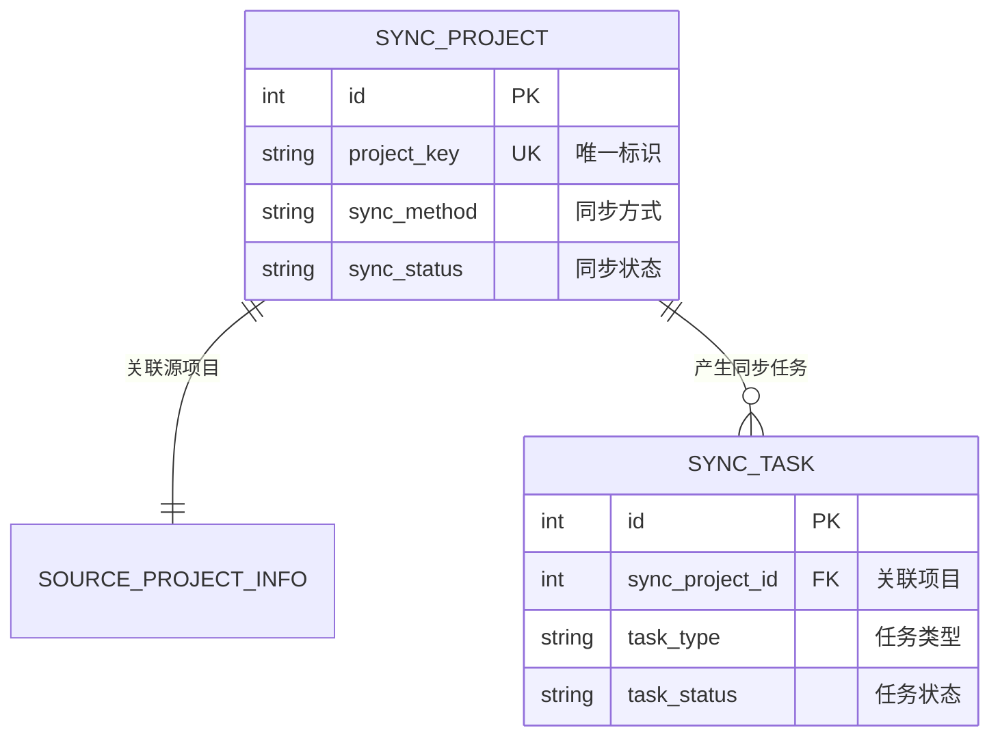
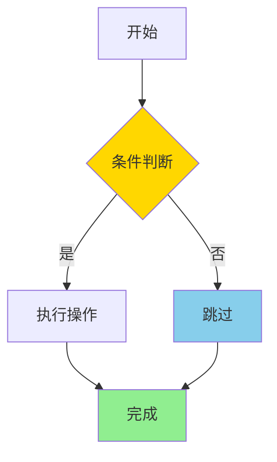

# 设计文档规范说明

## 📋 文档目的

本规范定义了 GitLab Mirror 项目设计文档的标准格式和结构，确保所有设计文档保持一致的风格、可读性和专业性。

## 🎯 核心原则

### 1. 视觉优先原则
- **优先使用图表**而非大段文字描述
- 使用 Mermaid 图表（ER图、流程图）可视化架构和流程
- 通过颜色高亮关键节点和决策点

### 2. 概念层面原则
- 专注于**架构、流程和概念**
- **不包含**代码片段、SQL语句、具体实现细节
- 保持适当的抽象层级

### 3. 结构化原则
- 使用统一的章节结构和 Emoji 标识
- 清晰的信息层次（章节 → 子章节 → 要点）
- 便于快速定位和理解

## 📚 标准文档结构

所有设计文档应遵循以下章节结构：

```markdown
## 📋 文档说明
- 文档目的和背景
- 适用场景和目标
- 与其他方案的关系

## 🏗️ 系统架构
- 架构概览图（可选）
- 核心组件说明
- 技术栈和依赖
- 架构对比（如有多方案）

## 📊 核心实体及关系
- Mermaid ER 图
- 实体详细说明（表格形式）
- 关系说明和约束

## 🔄 关键处理流程
- Mermaid 流程图（多个流程分别绘制）
- 流程节点颜色标注
- 关键决策点说明

## 🔌 REST API 设计
- API 端点列表（表格）
- 请求/响应示例（仅结构，无代码）
- 认证和错误处理

## 💻 CLI 命令设计
- 命令列表和语法
- 参数说明
- 示例输出（命令行格式）

## ⚙️ 实施要点
- 配置要求
- 性能优化策略
- 错误处理机制
- 监控和日志

## 📝 总结
- 核心价值
- 实施路径
- 注意事项
```

## 🎨 格式规范

### 章节标题

所有一级标题使用 Emoji 前缀：

| Emoji | 用途 | 示例 |
|-------|------|------|
| 📋 | 文档说明 | `## 📋 文档说明` |
| 🏗️ | 系统架构 | `## 🏗️ 系统架构` |
| 📊 | 数据模型 | `## 📊 核心实体及关系` |
| 🔄 | 流程设计 | `## 🔄 关键处理流程` |
| 🔌 | API 设计 | `## 🔌 REST API 设计` |
| 💻 | CLI 设计 | `## 💻 CLI 命令设计` |
| ⚙️ | 实施要点 | `## ⚙️ 实施要点` |
| 📝 | 总结 | `## 📝 总结` |

### Mermaid ER 图

**语法**：使用 `erDiagram` 语法

**关系符号**：
- `||--||` : 一对一
- `||--o{` : 一对多
- `||--o|` : 一对零或一

**示例**：
````markdown

````

**规范**：
- 实体名称使用大写下划线格式（如 `SYNC_PROJECT`）
- 关系描述使用中文引号标注
- 字段说明包含：类型、约束（PK/FK/UK）、中文描述

### Mermaid 流程图

**语法**：使用 `graph TD`（从上到下）或 `graph LR`（从左到右）

**颜色方案**：

| 颜色 | 十六进制 | 用途 |
|------|---------|------|
| 金色 | #FFD700 | 重要检查点 |
| 天蓝 | #87CEEB | 跳过/无变更 |
| 浅绿 | #90EE90 | 成功完成 |
| 浅红 | #FFB6C1 | 失败/错误 |
| 浅橙 | #FFE4B5 | 等待/挂起 |

**示例**：
````markdown

````

**规范**：
- 节点文字使用中文
- 决策节点使用菱形 `{}`
- 关键节点使用 `style` 标注颜色
- 连线标签说明条件
- 复杂流程换行使用 `<br/>`

### 表格规范

**实体字段说明表**：

```markdown
| 字段名 | 类型 | 约束 | 说明 |
|--------|------|------|------|
| id | BIGINT | PK, AUTO_INCREMENT | 主键 |
| project_key | VARCHAR(255) | UK, NOT NULL | 项目唯一标识 |
| sync_method | VARCHAR(50) | NOT NULL | 同步方式 |
```

**API 端点表**：

```markdown
| 方法 | 路径 | 说明 | 权限 |
|------|------|------|------|
| GET | /api/projects | 获取项目列表 | READ |
| POST | /api/projects/{key}/sync | 触发同步 | WRITE |
```

**CLI 命令表**：

```markdown
| 命令 | 说明 | 示例 |
|------|------|------|
| list | 列出所有项目 | `gitlab-mirror projects list` |
| sync | 触发同步 | `gitlab-mirror sync trigger <key>` |
```

### 代码块使用规范

**允许使用代码块的场景**：

1. **命令行示例**（使用 `bash` 或不标注语言）：
   ````markdown
   ```bash
   gitlab-mirror projects list --status active
   ```
   ````

2. **配置文件结构**（YAML/JSON，仅展示结构，无具体值）：
   ````markdown
   ```yaml
   gitlab:
     source:
       url: ${SOURCE_GITLAB_URL}
       token: ${SOURCE_GITLAB_TOKEN}
   ```
   ````

3. **API 请求/响应结构**（JSON，仅展示字段结构）：
   ````markdown
   ```json
   {
     "project_key": "group/project",
     "sync_status": "active",
     "last_sync_at": "2025-12-14T10:30:00Z"
   }
   ```
   ````

**禁止使用代码块的场景**：
- Java/Python/其他语言代码片段
- SQL 语句
- 具体实现逻辑
- 算法伪代码

### 列表和要点

**使用场景**：
- 功能特性列举
- 配置项说明
- 注意事项
- 实施步骤

**格式**：
```markdown
### 核心特性

- **特性一**：简要说明
  - 子要点 1
  - 子要点 2
- **特性二**：简要说明
- **特性三**：简要说明
```

## 📐 内容深度指南

### 数据模型章节

**应包含**：
- ER 图展示实体关系
- 实体表格说明（字段、类型、约束）
- 关系说明（1:1, 1:N, N:N）
- 索引策略（UK, INDEX）

**不应包含**：
- 完整 DDL 语句
- MyBatis Mapper 代码
- 数据库配置细节

### 流程设计章节

**应包含**：
- Mermaid 流程图
- 关键决策点说明
- 状态转换逻辑
- 错误处理分支

**不应包含**：
- 方法调用细节
- 具体代码实现
- 异常堆栈示例

### API 设计章节

**应包含**：
- 端点列表（方法、路径、说明）
- 请求参数结构
- 响应数据结构
- 错误码列表

**不应包含**：
- Controller 代码
- Service 实现
- 单元测试用例

### CLI 设计章节

**应包含**：
- 命令语法和参数
- 使用示例（命令行格式）
- 输出示例（终端格式）
- 交互流程说明

**不应包含**：
- Java 客户端代码
- HTTP 请求实现
- Shell 脚本源码

## ✅ 文档检查清单

提交设计文档前，请确认：

### 结构完整性
- [ ] 包含所有必需章节（📋🏗️📊🔄🔌💻⚙️📝）
- [ ] 章节顺序符合规范
- [ ] Emoji 标识正确使用

### 图表质量
- [ ] ER 图完整展示所有实体和关系
- [ ] 流程图覆盖主要业务流程
- [ ] 关键节点有颜色标注
- [ ] 图表文字清晰可读

### 内容准确性
- [ ] 实体字段说明完整
- [ ] API 端点和参数准确
- [ ] 命令示例可执行
- [ ] 无代码片段和 SQL 语句

### 格式规范
- [ ] 表格对齐规范
- [ ] 代码块语言标注正确
- [ ] 列表层级清晰
- [ ] 中英文标点符号正确

### 可读性
- [ ] 专业术语有说明
- [ ] 复杂概念有图表辅助
- [ ] 段落长度适中
- [ ] 重点内容有加粗或高亮

## 📝 示例文档

参考以下文档作为标准示例：

1. **`docs/PUSH_MIRROR_MVP_DESIGN.md`** - Push Mirror 方案设计
   - 标准章节结构示例
   - Mermaid 图表使用示例
   - 适当抽象层级示例

2. **`docs/PULL_SYNC_DESIGN.md`** - Pull 同步方案设计
   - 统一任务表设计示例
   - 流程图颜色标注示例
   - 配置分离架构示例

## 🔄 版本管理

设计文档应包含版本信息：

```markdown
**文档版本**：v1.0
**更新日期**：2025-12-14
**作者**：GitLab Mirror Team
```

重大修订时更新版本号和日期，保持文档可追溯性。

## 📖 总结

遵循本规范可以确保：

- **一致性**：所有设计文档风格统一
- **可读性**：通过图表和结构化内容提升理解效率
- **专业性**：保持适当抽象层级，专注架构和设计
- **可维护性**：标准化格式便于更新和扩展

设计文档是项目的重要资产，高质量的文档能够：
- 加速新成员理解系统
- 减少沟通成本
- 指导实施和测试
- 支持长期维护

**核心要点**：图表优先、概念层面、结构清晰、风格统一。
