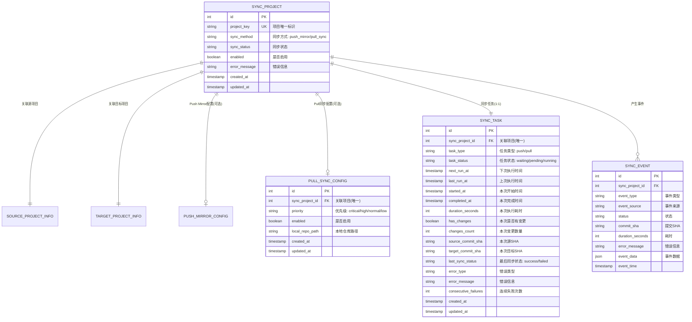
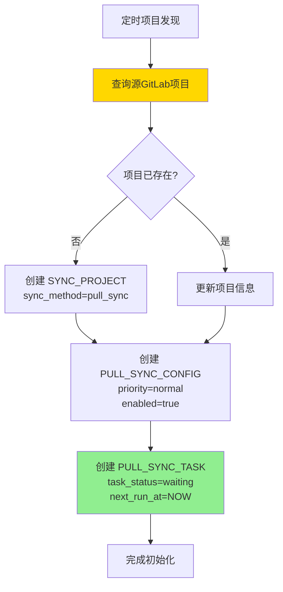
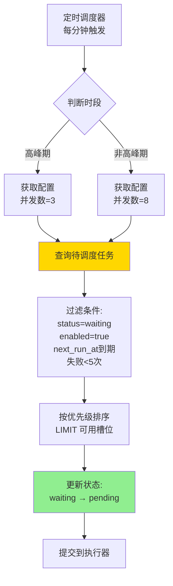
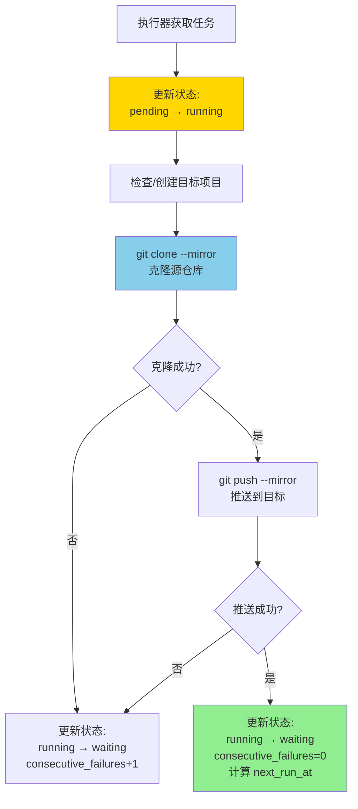
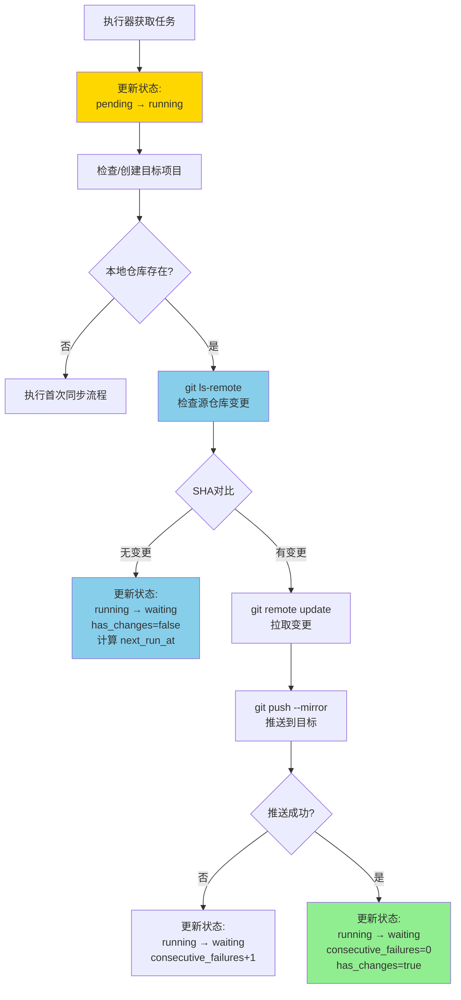
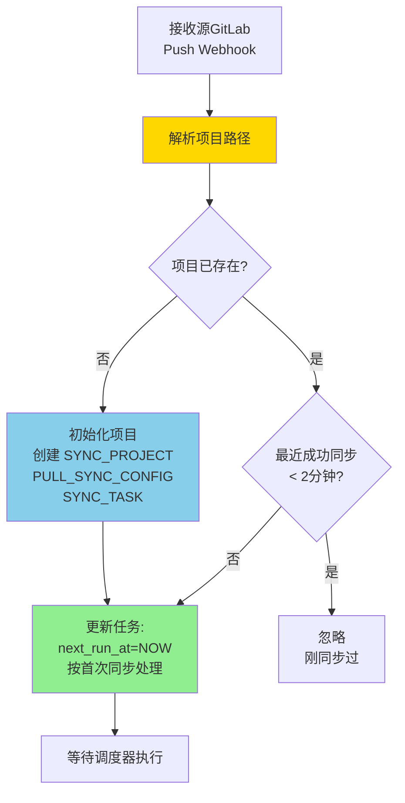
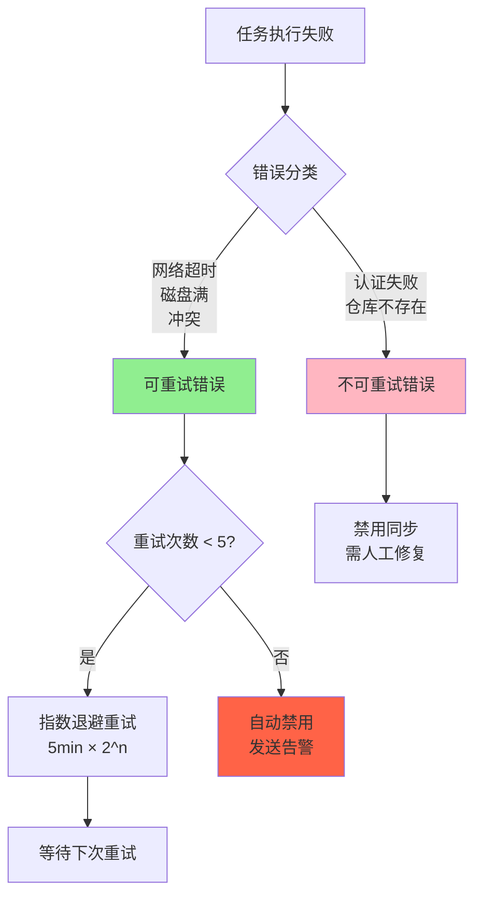

# Pull 同步方案设计

## 📋 文档说明

本文档描述基于 Clone & Push 策略的 Pull 同步方案详细设计。

**适用场景**：
- ✅ 无源 GitLab 管理员权限（无法配置 Push Mirror）
- ✅ 需要完全控制同步调度（200+ 项目）
- ✅ 源 GitLab 压力敏感
- ⚠️ 可接受分钟级同步延迟
- ⚠️ 需要本地磁盘空间（约 250MB/项目）

**核心思路**：
- 本地克隆源仓库（git clone --mirror）
- 推送到目标仓库（git push --mirror）
- 增量更新（git remote update --prune）
- 变更检测优化（git ls-remote，70-90% 项目无变更快速跳过）

---

## 🏗️ 系统架构

### 与 Push Mirror 的对比

| 维度 | Clone & Push (Pull) | Push Mirror |
|------|---------------------|-------------|
| 调度控制 | ✅ 完全可控（优先级、错峰、并发） | ⚠️ 依赖 GitLab 自动触发 |
| 权限要求 | ✅ 仅需项目访问权限 | ❌ 需源 GitLab 管理员权限 |
| 源压力 | ✅ 低（等同 3-8 个开发者 pull） | ⚠️ 高（200 个项目同时推送） |
| 实时性 | ⚠️ 分钟级延迟 | ✅ 秒级实时 |
| 磁盘消耗 | ❌ 需要本地存储（~50GB/200项目） | ✅ 无本地存储 |
| 适用规模 | ✅ 200+ 项目 | ⚠️ <100 项目 |
| 任务追踪 | ✅ 每次同步独立任务记录 | ⚠️ 仅 Mirror 状态 |

### 架构组件

```
┌─────────────────────────────────────────────────────────┐
│              Pull Sync Scheduler (定时调度器)           │
│  - 每分钟触发一次                                       │
│  - 按优先级和到期时间排序                               │
│  - 并发控制（高峰期 3，非高峰期 8）                     │
└────────────────────┬────────────────────────────────────┘
                     │
                     ▼
┌─────────────────────────────────────────────────────────┐
│           Pull Sync Task Executor (任务执行器)          │
│  - 变更检测（git ls-remote）                            │
│  - 克隆/更新本地仓库（git clone --mirror / remote update)│
│  - 推送到目标（git push --mirror）                      │
│  - 错误分类与重试                                       │
└────────────────────┬────────────────────────────────────┘
                     │
                     ▼
┌─────────────────────────────────────────────────────────┐
│              Local Mirror Repository                    │
│  ~/.gitlab-sync/repos/{project-id}/                     │
│  - 本地镜像仓库                                         │
│  - 持久化存储                                           │
└─────────────────────────────────────────────────────────┘
```

---

## 📊 核心实体及关系

### ER 实体关系图



### 实体说明

#### 1. SYNC_PROJECT（主表）
保持不变，通过 `sync_method` 字段区分不同同步方式。

**关键字段**：
- `sync_method`: 标识同步方式
  - `push_mirror`: Push Mirror 方式
  - `pull_sync`: Pull 同步方式（Clone & Push）

#### 2. PULL_SYNC_CONFIG（Pull 同步配置表，新增）
存储 Pull 同步的静态配置。

**关键字段**：
- `priority`: 优先级（critical/high/normal/low）
- `enabled`: 是否启用
- `local_repo_path`: 本地仓库路径

**设计原则**：
- **只包含静态配置**：priority, enabled, local_path
- **不包含调度参数**：间隔、并发数等作为全局配置
- **1:1 关系**：每个 pull_sync 项目有唯一配置

#### 3. SYNC_TASK（统一同步任务表，新增）
**每个项目对应唯一任务记录**，支持 Push 和 Pull 两种同步方式。

**任务类型**（task_type）：
- `push`: Push Mirror 方式（任务信息来自轮询源 GitLab Push Mirror 状态）
- `pull`: Pull 同步方式（任务由调度器直接执行）

**任务状态**（task_status）：
- `waiting`: 等待调度（初始状态和完成后状态）
- `pending`: 待执行（调度器已选中）
- `running`: 执行中

**调度字段**：
- `next_run_at`: 下次执行时间（调度器判断依据）
- `last_run_at`: 上次执行时间
- `last_sync_status`: 最后同步结果（success/failed）

**执行结果字段**（记录最近一次执行）：
- `has_changes`: 是否有变更
- `source_commit_sha`: 源仓库 SHA
- `error_type`, `error_message`: 错误信息
- `consecutive_failures`: 连续失败次数

**设计优势**：
- **统一任务表**：Push 和 Pull 任务统一管理
- **单一记录**：1个项目=1条任务记录，避免任务表膨胀
- **状态循环**：waiting → pending → running → waiting
- **历史追踪**：通过 SYNC_EVENT 记录每次执行历史

**Push vs Pull 差异**：
- **Push 任务**：定时轮询源 GitLab Mirror API 获取状态，更新任务字段
- **Pull 任务**：调度器将 waiting 改为 pending，执行器执行并更新结果

#### 4. SYNC_EVENT（事件表）
复用现有表，新增 Pull 同步事件类型。

**新增事件类型**：
- `pull_task_created`: Pull 任务创建
- `pull_changes_detected`: 检测到变更
- `pull_no_changes`: 无变更跳过
- `pull_fetch_completed`: 拉取完成
- `pull_push_completed`: 推送完成
- `pull_task_success`: Pull 任务成功
- `pull_task_failed`: Pull 任务失败

### 关系说明

```
SYNC_PROJECT (主表 - 通用同步管理)
    ├── SOURCE_PROJECT_INFO (1:1) - 源项目信息
    ├── TARGET_PROJECT_INFO (1:1) - 目标项目信息
    ├── PUSH_MIRROR_CONFIG (1:0..1) - Push Mirror 配置（可选）
    ├── PULL_SYNC_CONFIG (1:0..1) - Pull 同步配置（可选）
    ├── SYNC_TASK (1:N) - 统一任务表（Push/Pull 通用）
    └── SYNC_EVENT (1:N) - 事件历史
```

**设计优势**：
1. **统一任务视图**：Push 和 Pull 任务在同一表，方便查询和对比
2. **配置分离**：Push 和 Pull 配置分别存储，职责清晰
3. **主表不变**：SYNC_PROJECT 保持稳定，不扩展字段
4. **易于扩展**：通过 task_type 和 task_data（JSON）支持不同任务类型
5. **状态分离**：配置表只存静态配置，动态状态在任务表，避免频繁更新配置表

---

## 🔄 关键处理流程

### 流程 1: 项目发现与任务初始化



**说明**：
- 类似 Push Mirror 方式自动发现项目
- 每个项目创建唯一的任务记录
- 初始状态为 `waiting`，立即可被调度

---

### 流程 2: Pull 任务调度



**调度策略**：
- **全局配置**：高峰/低峰时段、并发数、间隔参数
- **优先级顺序**：critical > high > normal > low
- **失败控制**：连续失败≥5次自动禁用

---

### 流程 3: 任务执行（首次同步）



**状态流转**：
- `pending → running`：开始执行
- `running → waiting`：执行完成（成功或失败均回到 waiting）
- 失败时：`consecutive_failures++`，计算延迟重试时间
- 成功时：`consecutive_failures=0`，按优先级计算下次执行时间

---

### 流程 4: 任务执行（增量同步）



**优化策略**：
- **变更检测**：git ls-remote 快速检查，70-90% 项目无变更跳过
- **性能指标**：无变更 <1秒，小变更 2-5秒，大变更 15-60秒

---

### 流程 5: Webhook 准实时同步



**说明**：
- **Webhook URL**: `/api/webhook/gitlab/push`
- **触发条件**: 源 GitLab 项目发生 push 事件
- **自动初始化**: 未配置的项目自动创建同步配置和任务
- **防抖动**: 2分钟内只触发一次，避免频繁同步
- **准实时**: 结合定时调度(3分钟)，实现准实时同步

---

### 流程 6: 错误处理与重试



**重试时间表**：
- 第 1 次失败：5 分钟后重试
- 第 2 次失败：10 分钟后重试
- 第 3 次失败：20 分钟后重试
- 第 4 次失败：40 分钟后重试
- 第 5 次失败：80 分钟后重试
- 第 6 次失败：放弃重试，自动禁用

**错误类型分类**：
- **可重试**：NETWORK_TIMEOUT, DISK_FULL, CONFLICT
- **不可重试**：AUTH_FAILED, REPO_NOT_FOUND

---

## 🔌 REST API 设计

### 现有接口（复用）

现有 `/api/projects` 接口保持不变：
- `GET /api/projects` - 查询项目列表
- `GET /api/projects/{key}` - 查询项目详情
- `POST /api/projects/discover` - 项目发现
- `POST /api/projects/{key}/setup-target` - 创建目标项目

### 新增接口

#### Webhook 接口

**POST /api/webhook/gitlab/push**
- 功能：接收源 GitLab Push Webhook
- 认证：GitLab Webhook Secret Token
- 请求体：GitLab Push Event JSON
- 逻辑：
  - 解析项目路径（project.path_with_namespace）
  - 检查项目是否已配置同步
    - **未配置**：自动初始化
      - 创建 SYNC_PROJECT（sync_method=pull_sync）
      - 创建 PULL_SYNC_CONFIG（priority=normal, enabled=true）
      - 创建 SOURCE_PROJECT_INFO（从 Webhook 数据填充）
      - 创建 SYNC_TASK（task_type=pull, task_status=waiting, next_run_at=NOW）
    - **已配置**：检查最近成功同步时间
      - 若 < 2分钟：忽略（防抖）
      - 若 ≥ 2分钟：更新 `next_run_at=NOW` 触发立即调度
- 返回：`{"status": "accepted", "action": "initialized|scheduled"}` 或 `{"status": "ignored", "reason": "..."}`

#### Pull 配置管理

**GET /api/pull-sync/projects/{key}/config**
- 功能：查询项目 Pull 配置
- 返回：PULL_SYNC_CONFIG 配置信息

**PUT /api/pull-sync/projects/{key}/config**
- 功能：更新项目 Pull 配置
- 参数：priority, enabled
- 返回：更新后的配置

#### 任务触发

**POST /api/pull-sync/trigger**
- 功能：触发单个项目同步
- 参数：project_key, force, full_resync
- 返回：task_id, task_status

**POST /api/pull-sync/trigger/batch**
- 功能：批量触发
- 参数：project_keys, priority
- 返回：triggered_count, task_ids

#### 任务查询

**GET /api/sync-tasks**
- 功能：查询任务列表（Push/Pull 统一）
- 参数：task_type, task_status, project_key, page, size
- 返回：任务列表

**GET /api/sync-tasks/{taskId}**
- 功能：查询任务详情
- 返回：完整任务信息

**GET /api/sync-tasks/projects/{key}/history**
- 功能：查询项目任务历史
- 参数：task_type, limit
- 返回：历史任务列表

#### 统计分析

**GET /api/pull-sync/stats/overview**
- 功能：全局统计
- 返回：总项目数、状态分布、优先级统计、24h 性能

**GET /api/pull-sync/stats/failed**
- 功能：失败项目列表
- 参数：min_failures
- 返回：失败项目详情

**GET /api/pull-sync/errors/statistics**
- 功能：错误统计
- 参数：hours
- 返回：错误类型分布

#### 磁盘管理

**GET /api/pull-sync/disk/usage**
- 功能：磁盘使用统计
- 数据来源：SOURCE_PROJECT_INFO.repository_size（源仓库大小）
- 返回：总使用量（所有 pull_sync 项目的 repository_size 总和）、可用空间、Top 项目

**POST /api/pull-sync/projects/{key}/cleanup**
- 功能：清理本地仓库
- 参数：action（gc/delete）
- 返回：释放空间、操作结果

---

## 💻 CLI 命令设计

### 兼容现有命令

```bash
gitlab-mirror projects [OPTIONS]    # 列出所有项目
gitlab-mirror discover               # 项目发现
gitlab-mirror project <key>          # 查看项目详情
```

### 新增 Pull 同步命令

#### 任务触发

```bash
# 触发单个项目
gitlab-mirror pull-sync trigger <project-key>
gitlab-mirror pull-sync trigger <project-key> --force
gitlab-mirror pull-sync trigger <project-key> --full-resync

# 批量触发
gitlab-mirror pull-sync trigger --priority=critical
gitlab-mirror pull-sync trigger --all
```

#### 任务查询

```bash
# 查看任务列表
gitlab-mirror tasks list [--type=pull_sync] [--status=success]
gitlab-mirror tasks show <task-id>
gitlab-mirror tasks history <project-key>
```

输出示例：
```
Sync Tasks (Total: 320, Page: 1/16)

ID      Project         Type        Status   Changes  Duration  Time
────────────────────────────────────────────────────────────────────
45321   devops/core    pull_sync   success  5        8s        10:00:08
45320   devops/core    pull_sync   skipped  0        0.5s      09:30:00
45319   devops/payment push_mirror success  -        -         09:29:55
```

#### 进度统计

```bash
gitlab-mirror pull-sync progress
gitlab-mirror pull-sync progress --priority=critical
gitlab-mirror pull-sync progress --watch
```

输出示例：
```
Pull Sync Progress Overview
════════════════════════════════════════════════════

Total Projects: 200
  Active:  180 (90.0%)
  Running: 5   (2.5%)
  Failed:  5   (2.5%)

By Priority:
┌──────────┬───────┬────────┬─────────────┐
│ Priority │ Total │ Active │ Avg Delay   │
├──────────┼───────┼────────┼─────────────┤
│ critical │ 10    │ 10     │ 5 min       │
│ high     │ 30    │ 29     │ 12 min      │
│ normal   │ 100   │ 92     │ 25 min      │
│ low      │ 60    │ 49     │ 2 hours     │
└──────────┴───────┴────────┴─────────────┘

Estimated Disk Usage: 50.5 GB (based on source repository sizes)
```

#### 错误分析

```bash
gitlab-mirror pull-sync errors stats
gitlab-mirror pull-sync errors failed
gitlab-mirror pull-sync errors show <project-key>
gitlab-mirror pull-sync errors reset <project-key>
```

#### 磁盘管理

```bash
gitlab-mirror pull-sync disk usage
gitlab-mirror pull-sync disk cleanup <project-key>
gitlab-mirror pull-sync disk delete <project-key>
```

---

## ⚙️ 实施要点

### 服务分层

**新增服务**：
1. **PullSyncConfigService** - 配置管理
2. **PullSyncTaskService** - 任务执行
3. **PullSyncScheduler** - 定时调度
4. **GitCommandExecutor** - Git 命令封装
5. **SyncTaskService** - 统一任务管理（Push/Pull 通用）

**复用服务**：
- **TargetProjectManagementService** - 创建目标分组和项目（核心依赖）
  - 每次同步前检查目标项目是否存在
  - 不存在则调用 `createTargetProject(syncProjectId)` 创建
  - 递归创建多级分组结构
- **ProjectDiscoveryService** - 项目发现（可选）
- **EventManagementService** - 事件记录

### 配置管理

**全局调度配置**（application.yml）：

```yaml
sync:
  scheduler:
    cron: "0 * * * * ?"           # 调度器执行频率：每分钟
    default-interval: 3           # 默认检查间隔：3分钟

  # 高峰/低峰时段配置
  peak-hours: "9-18"               # 高峰时段：9:00-18:00
  peak-concurrent: 3               # 高峰期最大并发数
  off-peak-concurrent: 8           # 非高峰期最大并发数

  # Pull同步执行间隔（按优先级）
  pull:
    interval:
      critical: 10                # critical 项目：10分钟
      high: 30                    # high 项目：30分钟
      normal: 120                 # normal 项目：2小时
      low: 360                    # low 项目：6小时

    webhook:
      enabled: true               # 启用 Webhook 准实时同步
      secret-token: ${WEBHOOK_SECRET}  # Webhook 密钥
      debounce-seconds: 120       # 防抖动时间：2分钟

    local-repo:
      base-path: ~/.gitlab-sync/repos
      min-free-space-gb: 50

    retry:
      max-failures: 5             # 连续失败5次自动禁用
      base-delay-minutes: 5       # 重试基础延迟
      auto-disable: true

  # Push Mirror轮询配置
  push:
    poll-interval: 30             # 轮询间隔：30秒
```

**说明**：
- **统一调度器**：Push 和 Pull 任务使用同一个调度器
- **默认调度间隔**：3分钟检查一次待执行任务
- **Webhook 准实时**：源 GitLab push 后触发立即同步（防抖2分钟）
- **优先级间隔**：不同优先级项目有不同的执行间隔
- **峰谷调度**：高峰期降低并发，避免影响业务

### 监控指标

**任务执行指标**：
- `pull_tasks_total`
- `pull_tasks_success`
- `pull_tasks_failed`
- `pull_tasks_skipped`
- `pull_task_duration_seconds`

**变更指标**：
- `pull_changes_detected_rate`
- `pull_commits_synced_total`

**资源指标**：
- `pull_disk_usage_bytes`
- `pull_concurrent_tasks`

---

## 📝 总结

### 方案优势

1. **统一任务表** - Push 和 Pull 任务使用同一个 SYNC_TASK 表，1个项目=1条任务记录
2. **单一记录** - 任务状态循环（waiting → pending → running → waiting），避免任务表膨胀
3. **全局配置** - 高峰/低峰时段、并发数、间隔等作为全局配置，简化管理
4. **准实时同步** - Webhook + 定时调度结合，实现准实时同步（防抖2分钟）
5. **优先级调度** - critical/high/normal/low 四级优先级，不同执行间隔
6. **高效检测** - git ls-remote 变更检测，70-90% 项目无变更快速跳过
7. **智能重试** - 错误自动分类，连续失败≥5次自动禁用
8. **自动恢复** - 同步前自动检查并创建目标项目
9. **历史追踪** - 通过 SYNC_EVENT 记录每次执行历史

### 实施路径

**Phase 1** - 数据模型（1-2 天）
- 创建 PULL_SYNC_CONFIG 表（priority, enabled, local_repo_path）
- 创建 SYNC_TASK 表（统一任务表，1:1关系）
- 添加 task_type 字段区分 push/pull

**Phase 2** - 项目发现（1 天）
- 扩展 ProjectDiscoveryService 支持 pull_sync 类型
- 自动创建 PULL_SYNC_CONFIG 和 SYNC_TASK 记录

**Phase 3** - Pull 同步执行器（3-4 天）
- PullSyncExecutor（执行 pending 状态任务）
- GitCommandExecutor（git 命令封装）
- 状态更新：pending → running → waiting

**Phase 4** - 统一调度器（2-3 天）
- SyncScheduler（统一调度 Push 和 Pull）
- 状态更新：waiting → pending
- 峰谷并发控制

**Phase 5** - Push Mirror 适配（1-2 天）
- 将现有 Push Mirror 轮询适配到 SYNC_TASK 表
- 更新任务状态和执行结果

**Phase 6** - Webhook 准实时同步（1-2 天）
- WebhookController 接收 GitLab Push Event
- 解析项目路径和验证 Secret Token
- 防抖逻辑（检查最近成功同步时间）
- 更新 `next_run_at=NOW` 触发立即调度

**Phase 7** - REST API（2-3 天）
- 任务查询接口（统一 Push/Pull）
- 配置管理接口
- 手动触发接口

**Phase 8** - CLI 命令（2 天）
- tasks 命令（查看所有任务）
- trigger 命令（手动触发）

**Phase 9** - 测试优化（3-4 天）

**预计总开发周期**：2-3 周
