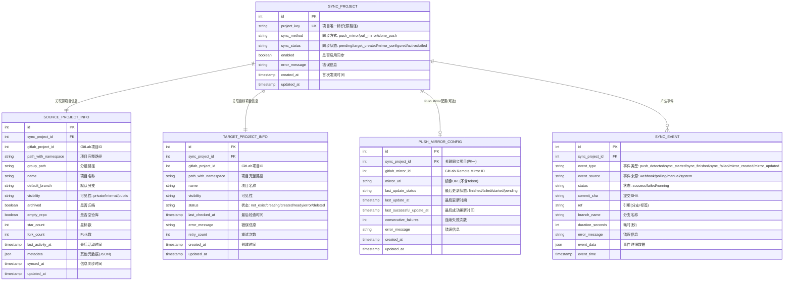
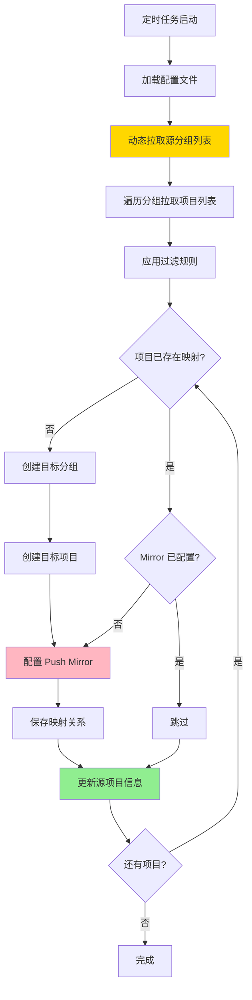
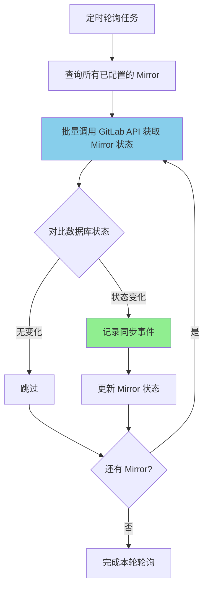
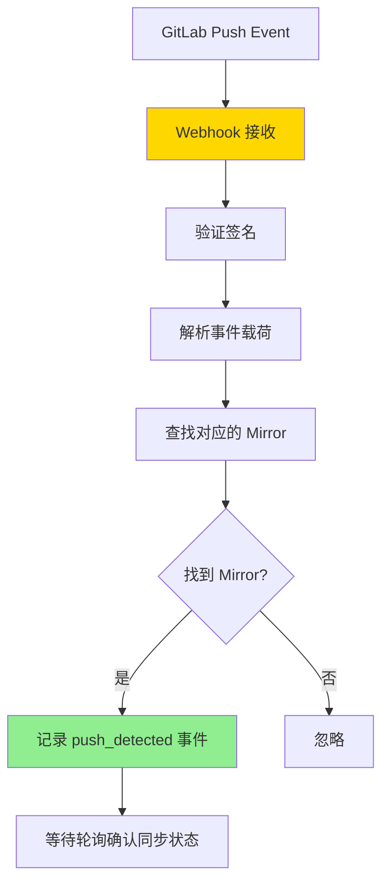
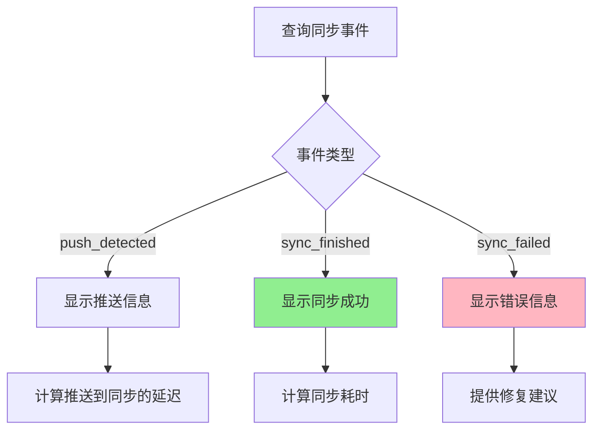

# Push Mirror 方案 MVP 详细设计

## 📋 文档说明

本文档描述基于 GitLab Push Mirror 功能的同步工具的详细设计方案。

**适用场景**：
- ✅ 有源 GitLab 的管理员权限（可配置 Push Mirror）
- ✅ 主要需求是 Git 仓库同步（代码、分支、标签、提交历史）
- ⚠️ 不需要同步 Issues/MR/Wiki 等元数据（Push Mirror 不支持）

**技术架构**：
- **客户端/服务端分离**：CLI 客户端通过 HTTP RESTful API 与同步服务通信
- **简单身份认证**：支持 API Token 认证机制
- **状态持久化**：使用 SQLite 数据库存储同步状态

---

## 🏗️ 系统架构

### 整体架构

**架构模式**：客户端/服务端分离

**组件说明**：

1. **CLI 客户端 (gitlab-mirror-cli)**
   - 用户交互界面（命令行）
   - 配置文件管理
   - 通过 HTTP RESTful API 与同步服务通信
   - 支持 API Token 认证

2. **同步服务 (gitlab-mirror-service)**
   - HTTP RESTful API 服务器
   - 执行实际的同步逻辑
   - 管理 GitLab API 调用
   - 状态持久化（SQLite）
   - 日志记录和监控

3. **状态数据库 (SQLite)**
   - 存储项目同步状态
   - 存储 Push Mirror 配置信息
   - 存储执行历史和错误日志

**通信流程**：
```
用户 → CLI 客户端 → [HTTP REST API + Token] → 同步服务 → GitLab API (源/目标)
                                                    ↓
                                              状态数据库 (SQLite)
```

**身份认证**：
- CLI 客户端在配置文件中存储 API Token
- 每次 HTTP 请求携带 Token（Authorization Header）
- 同步服务验证 Token 有效性
- 支持多个 Token（多用户场景）

---

## 📊 核心实体及关系

### ER 实体关系图



**实体说明**：

### 1. **SYNC_PROJECT（同步项目主表）**
**核心主表**，管理需要同步的项目，不包含特定同步方式的配置

**关键字段**：
- **project_key**: 项目唯一标识（源项目路径，如 `group1/project-a`）
- **sync_method**: 同步方式标识
  - `push_mirror`: Push Mirror 方式（MVP）
  - `pull_mirror`: Pull Mirror 方式（未来）
  - `clone_push`: Clone & Push 方式（未来）
- **sync_status**: 同步流程状态
  - `pending`: 待处理（刚发现）
  - `target_created`: 目标项目已创建
  - `mirror_configured`: Mirror 已配置
  - `active`: 正常运行
  - `failed`: 失败
- **enabled**: 是否启用同步
- **error_message**: 通用错误信息

**职责**：
- 管理同步项目的完整生命周期
- 标识使用的同步方式
- 记录通用同步状态
- 与具体同步方式配置解耦

---

### 2. **SOURCE_PROJECT_INFO（源项目信息表）**
**扩展表**，存储从源 GitLab 动态拉取的项目详细信息

**关键字段**：
- **gitlab_project_id**: 源 GitLab 的项目 ID
- **path_with_namespace**: 完整路径
- **group_path**: 分组路径
- **archived/empty_repo**: 用于过滤决策
- **last_activity_at**: 判断项目活跃度
- **synced_at**: 信息最后拉取时间

**职责**：
- 存储源项目详细信息
- 定期更新（每次项目发现任务）
- 用于过滤和决策

---

### 3. **TARGET_PROJECT_INFO（目标项目信息表）**
**扩展表**，存储在目标 GitLab 创建的项目信息

**关键字段**：
- **gitlab_project_id**: 目标 GitLab 的项目 ID
- **status**: 目标项目状态
  - `not_exist`: 未创建
  - `creating`: 创建中
  - `created`: 已创建（未配置同步）
  - `ready`: 就绪（同步已配置）
  - `error`: 错误状态
  - `deleted`: 已被删除
- **last_checked_at**: 最后检查时间（用于验证项目是否还存在）
- **error_message**: 错误信息
- **retry_count**: 重试次数

**职责**：
- 记录目标项目状态
- 存储目标项目 GitLab ID
- 跟踪项目存在性和健康状态

---

### 4. **PUSH_MIRROR_CONFIG（Push Mirror 配置表）**
**同步方式配置表**，存储 Push Mirror 特定的配置和状态

**关键字段**：
- **sync_project_id**: 关联的同步项目（唯一外键）
- **gitlab_mirror_id**: GitLab Remote Mirror ID（API 返回）
- **mirror_url**: 镜像 URL（不含 token）
- **last_update_status**: Mirror 最后更新状态（finished/failed/started/pending）
- **last_update_at**: 最后更新时间
- **last_successful_update_at**: 最后成功更新时间
- **consecutive_failures**: 连续失败次数（用于告警）
- **error_message**: Push Mirror 特定的错误信息

**职责**：
- 存储 Push Mirror 特定配置
- 记录 Mirror 同步状态和历史
- 与 SYNC_PROJECT 1:1 关系
- 隔离 Push Mirror 特定字段

**未来扩展**：
- 可新增 `PULL_MIRROR_CONFIG` 表（Pull Mirror 配置）
- 可新增 `CLONE_PUSH_CONFIG` 表（Clone & Push 配置）
- 每种同步方式有自己的配置表

---

### 5. **SYNC_EVENT（同步事件表）**
**事件表**，记录所有同步相关事件

**事件类型**：
- **push_detected**: 检测到推送
- **sync_started**: 同步开始
- **sync_finished**: 同步完成
- **sync_failed**: 同步失败
- **mirror_created**: Mirror 创建
- **mirror_updated**: Mirror 配置更新

**职责**：
- 记录完整的同步事件时间线
- 用于监控和分析
- 计算推送到同步的延迟
- 故障排查

---

## 关系说明

```
SYNC_PROJECT (主表 - 通用同步管理)
    ├── SOURCE_PROJECT_INFO (1:1) - 源项目详细信息
    ├── TARGET_PROJECT_INFO (1:1) - 目标项目信息
    ├── PUSH_MIRROR_CONFIG (1:0..1) - Push Mirror 配置（可选）
    └── SYNC_EVENT (1:N) - 同步事件历史
```

**设计优势**：

1. **支持多种同步方式**
   - SYNC_PROJECT 使用 `sync_method` 字段标识同步方式
   - 每种同步方式有独立的配置表（如 PUSH_MIRROR_CONFIG）
   - 未来可扩展：PULL_MIRROR_CONFIG, CLONE_PUSH_CONFIG 等
   - 灵活切换同步方式

2. **清晰的职责分离**
   - SYNC_PROJECT：通用同步流程管理
   - SOURCE_PROJECT_INFO：源项目详细信息（定期更新）
   - TARGET_PROJECT_INFO：目标项目信息（状态跟踪）
   - PUSH_MIRROR_CONFIG：Push Mirror 特定配置和状态
   - SYNC_EVENT：事件历史（仅追加）

3. **良好的扩展性**
   - 新增同步方式只需添加新的配置表
   - 主表结构保持稳定
   - 不同同步方式可以有各自的字段
   - 避免主表字段膨胀

4. **数据隔离和维护**
   - Push Mirror 特定字段隔离在 PUSH_MIRROR_CONFIG
   - 便于针对不同同步方式优化和维护
   - 查询性能：按需 JOIN 配置表

---

## 🔄 关键处理流程

### 流程 1: 项目发现和 Mirror 配置



**说明**：
- **动态拉取**: 定时从源 GitLab 拉取最新分组和项目信息
- **增量处理**: 仅为新项目创建目标项目和配置 Mirror
- **幂等操作**: 已配置的 Mirror 不会重复创建
- **持久化**: 所有信息保存到数据库

---

### 流程 2: Mirror 状态监控（轮询）



**说明**：
- **定时轮询**: 每隔一定时间（如 30 秒）轮询一次
- **批量查询**: 批量获取 Mirror 状态，减少 API 调用
- **状态变化检测**: 对比数据库记录，仅记录变化的事件
- **事件记录**: 记录 sync_started、sync_finished、sync_failed 等事件

---

### 流程 3: Webhook 事件接收（可选）



**说明**：
- **Webhook**: 接收源 GitLab 的 Push 事件
- **事件记录**: 记录推送事件，用于追踪
- **被动监控**: 不主动触发同步，等待轮询确认 Mirror 同步结果

---

### 流程 4: 同步事件分析



**说明**：
- **事件关联**: 关联 push 和 sync 事件，分析同步延迟
- **性能分析**: 统计同步耗时
- **故障分析**: 分析失败原因，提供建议

---

## 🌐 REST API 设计

### API 端点列表

#### 1. 服务状态

**获取服务状态**
- **端点**: GET /api/status
- **认证**: 需要 API Token
- **响应**: 服务运行状态、配置加载状态、定时任务状态、整体统计

**重新加载配置**
- **端点**: POST /api/reload
- **认证**: 需要 API Token
- **响应**: 配置重新加载结果

---

#### 2. 同步项目

**获取同步项目列表**
- **端点**: GET /api/projects
- **认证**: 需要 API Token
- **查询参数**:
  - sync_status: 同步状态过滤（pending/active/failed）
  - enabled: 是否启用
  - page, per_page: 分页
- **响应**: 同步项目列表（含源项目信息、目标项目信息、Mirror 状态）

**获取项目详情**
- **端点**: GET /api/projects/:project_key
- **认证**: 需要 API Token
- **响应**:
  - 同步项目基本信息
  - 源项目详细信息
  - 目标项目信息
  - Mirror 配置和状态
  - 最近同步事件

**手动触发项目发现**
- **端点**: POST /api/projects/discover
- **认证**: 需要 API Token
- **响应**: 新发现的项目数量、创建的项目数量

**重新配置项目 Mirror**
- **端点**: POST /api/projects/:project_key/setup-mirror
- **认证**: 需要 API Token
- **响应**: Mirror 配置结果

---

#### 3. Mirror 状态

**获取 Mirror 列表**
- **端点**: GET /api/mirrors
- **认证**: 需要 API Token
- **查询参数**:
  - status: Mirror 状态过滤（active/failed）
  - last_update_status: 最后更新状态（finished/failed）
  - page, per_page: 分页
- **响应**: Mirror 列表及状态

**获取 Mirror 一致性检查**
- **端点**: GET /api/mirrors/:project_key/consistency
- **认证**: 需要 API Token
- **响应**:
  - 源仓库分支数、commit 数
  - 目标仓库分支数、commit 数
  - 默认分支最后 commit SHA 对比
  - 一致性状态

**手动触发轮询**
- **端点**: POST /api/mirrors/poll
- **认证**: 需要 API Token
- **响应**: 轮询的 Mirror 数量、状态更新数量

---

#### 4. 同步事件

**获取事件列表**
- **端点**: GET /api/events
- **认证**: 需要 API Token
- **查询参数**:
  - project_key: 项目过滤
  - event_type: 事件类型过滤
  - status: 状态过滤
  - start_time, end_time: 时间范围
  - page, per_page: 分页
- **响应**: 同步事件列表

**Webhook 接收端点**（可选）
- **端点**: POST /api/webhooks/push
- **认证**: Webhook Secret 验证
- **请求体**: GitLab Push Event
- **响应**: 接收确认

---

#### 5. 统计

**获取整体统计**
- **端点**: GET /api/stats
- **认证**: 需要 API Token
- **响应**:
  - 总项目数
  - 同步状态分布（pending/active/failed）
  - Mirror 状态分布
  - 最近同步统计（24小时内）
  - 失败项目数量

### 认证机制

**Token 存储**：
- CLI 客户端配置文件中存储服务 API Token
- 环境变量方式：GITLAB_MIRROR_API_TOKEN

**Token 传递**：
- HTTP Header: Authorization: Bearer <token>

**Token 验证**：
- 服务端验证 Token 有效性
- 支持 Token 过期时间
- 支持 Token 权限级别（只读/读写）

**安全性**：
- HTTPS 通信（生产环境）
- Token 加密存储（可选）
- Token 定期轮换（建议）

---

## 💻 CLI 命令设计

### 设计原则

**配置文件优先**：
- 用户直接编辑配置文件
- CLI 仅用于查看状态和手动操作
- 服务自动运行，动态拉取项目

**核心理念**：
```
修改配置文件 → 服务自动发现项目和配置 Mirror → CLI 监控状态和事件
```

---

### 核心命令

#### 1. 服务管理

**启动服务**
```bash
gitlab-mirror-service start
```
- 启动同步服务
- 加载配置文件
- 启动定时任务（项目发现、Mirror 轮询）

**停止服务**
```bash
gitlab-mirror-service stop
```
- 停止同步服务
- 停止所有定时任务

**查看服务状态**
```bash
gitlab-mirror-service status
```
- 显示服务运行状态
- 显示配置文件路径
- 显示定时任务状态

**重新加载配置**
```bash
gitlab-mirror-service reload
```
- 重新加载配置文件
- 不中断服务运行

---

#### 2. 监控状态

**查看整体概览**
```bash
gitlab-mirror status
```

**输出示例**：
```
┌─────────────────────────────────────────────────────────────┐
│ GitLab Mirror 监控面板                                      │
├─────────────────────────────────────────────────────────────┤
│ 服务状态: ✅ 运行中                                         │
│ 配置文件: /etc/gitlab-mirror/config.yml                    │
│ 上次拉取项目: 2025-12-13 10:30:00 (5 分钟前)               │
│ 上次轮询 Mirror: 2025-12-13 10:35:30 (30 秒前)             │
└─────────────────────────────────────────────────────────────┘

Mirror 统计：
  总项目数: 142
  总 Mirror 数: 140
  ✅ Active: 135 (96.4%)
  ❌ Failed: 5 (3.6%)

最近同步事件 (最近 10 条):
  ✅ group1/project-a  sync_finished  (2 分钟前, 耗时 15s)
  ✅ group1/project-b  sync_finished  (3 分钟前, 耗时 22s)
  ❌ group2/project-x  sync_failed    (5 分钟前, 错误: permission denied)
  🔄 group2/large-repo sync_started   (5 分钟前)

失败 Mirror (5):
  ❌ group2/project-x: 权限拒绝
  ❌ group3/project-y: 网络超时
  ❌ group4/project-z: Mirror 配置错误

提示：使用 'gitlab-mirror mirrors --failed' 查看失败详情
```

**选项**：
- --refresh <seconds>：自动刷新（实时监控）

---

**查看 Mirror 列表**
```bash
gitlab-mirror mirrors
```

**功能**：
- 显示所有 Mirror 状态列表

**选项**：
- --failed：仅显示失败的 Mirror
- --active：仅显示活跃的 Mirror
- --project <path>：过滤特定项目

**输出示例**：
```
Mirror 列表 (总计: 140)

┌────────────────────────────┬───────────┬──────────────────┬─────────────────┐
│ 项目路径                   │ 状态      │ 最后更新状态     │ 最后更新时间    │
├────────────────────────────┼───────────┼──────────────────┼─────────────────┤
│ group1/project-a           │ ✅ Active │ finished         │ 2分钟前         │
│ group1/project-b           │ ✅ Active │ finished         │ 3分钟前         │
│ group2/project-x           │ ❌ Failed │ failed           │ 5分钟前         │
│ group2/large-repo          │ ✅ Active │ started          │ 5分钟前         │
└────────────────────────────┴───────────┴──────────────────┴─────────────────┘
```

---

**查看 Mirror 详情**
```bash
gitlab-mirror mirror <project_path>
```

**输出示例**：
```
项目: group2/project-x

基本信息：
  源项目 ID: 12345
  源项目路径: group2/project-x
  目标项目 ID: 67890
  目标项目路径: group2/project-x

Mirror 配置：
  GitLab Mirror ID: 156
  状态: ❌ Failed
  启用: 是
  最后更新状态: failed
  最后更新时间: 2025-12-13 10:25:00
  最后成功更新: 2025-12-13 09:15:00
  错误信息: Target repository permission denied

一致性检查：
  源仓库分支数: 5
  目标仓库分支数: 4
  源仓库最后 commit: a1b2c3d (2025-12-13 10:30:00)
  目标仓库最后 commit: e4f5g6h (2025-12-13 09:15:00)
  ⚠️ 不一致

最近同步事件 (最近 5 条):
  2025-12-13 10:30:00  push_detected  (SHA: a1b2c3d, ref: main)
  2025-12-13 10:25:00  sync_failed    (错误: permission denied)
  2025-12-13 09:20:00  push_detected  (SHA: h7i8j9k, ref: main)
  2025-12-13 09:15:30  sync_finished  (耗时: 15s)
  2025-12-13 09:15:15  sync_started

建议操作：
  1. 检查目标项目权限
  2. 运行: gitlab-mirror mirror group2/project-x --setup 重新配置
```

**选项**：
- --consistency：检查源和目标仓库一致性

---

**查看同步事件**
```bash
gitlab-mirror events
```

**功能**：
- 查看最近的同步事件

**选项**：
- --project <path>：过滤特定项目
- --type <event_type>：过滤事件类型
- --failed：仅显示失败事件
- --limit <N>：限制显示数量

**输出示例**：
```
同步事件列表 (最近 20 条)

时间                    项目                   事件类型         状态     详情
────────────────────────────────────────────────────────────────────────────
2025-12-13 10:35:00     group1/project-a      sync_finished    成功     耗时 15s
2025-12-13 10:34:45     group1/project-a      sync_started     -        -
2025-12-13 10:34:30     group1/project-a      push_detected    -        SHA: a1b2c3d
2025-12-13 10:30:00     group2/project-x      sync_failed      失败     permission denied
2025-12-13 10:29:45     group2/project-x      sync_started     -        -
```

---

#### 3. 项目管理

**查看源项目列表**
```bash
gitlab-mirror projects
```

**功能**：
- 显示从源 GitLab 动态拉取的项目列表

**选项**：
- --group <path>：过滤特定分组
- --no-mirror：仅显示未配置 Mirror 的项目

---

**手动触发项目发现**
```bash
gitlab-mirror discover
```

**功能**：
- 立即从源 GitLab 拉取最新项目列表
- 为新项目配置 Mirror

---

**为项目配置 Mirror**
```bash
gitlab-mirror mirror <project_path> --setup
```

**功能**：
- 为指定项目手动配置 Mirror
- 用于重试失败的配置

---

#### 4. 其他工具

**导出数据**
```bash
gitlab-mirror export --format json --output mirrors.json
```

**功能**：
- 导出 Mirror 状态数据
- 导出同步事件数据

**选项**：
- --type: mirrors/events/all
- --format: json/csv
- --output: 输出文件路径

---

### 简化使用流程

**首次使用**：
```bash
# 1. 编辑配置文件
vi /etc/gitlab-mirror/config.yml

# 2. 启动服务（自动拉取项目和配置 Mirror）
gitlab-mirror-service start

# 3. 查看状态
gitlab-mirror status
```

**日常使用**：
```bash
# 服务自动运行，仅需查看状态
gitlab-mirror status

# 或实时监控
gitlab-mirror status --refresh 10
```

**处理问题**：
```bash
# 1. 查看失败的 Mirror
gitlab-mirror mirrors --failed

# 2. 查看详情
gitlab-mirror mirror group2/project-x

# 3. 修复问题后重新配置
gitlab-mirror mirror group2/project-x --setup
```

---

## 📊 配置文件格式

### 配置文件路径

**默认路径**: /etc/gitlab-mirror/config.yml

**环境变量**: GITLAB_MIRROR_CONFIG

### 完整配置示例

```yaml
# GitLab 源和目标配置
source:
  url: https://source.gitlab.com
  token: ${SOURCE_GITLAB_TOKEN}  # 环境变量

target:
  url: https://target.gitlab.com
  token: ${TARGET_GITLAB_TOKEN}  # 环境变量

# 同步配置（动态拉取）
sync:
  # 包含的分组路径（支持通配符）
  include_groups:
    - "group1/**"           # 包含 group1 及所有子分组
    - "group2/subgroup"     # 仅包含特定子分组
    - "group3"              # 包含 group3（不含子分组）

  # 排除的分组路径
  exclude_groups:
    - "group1/archived/**"
    - "*/test-*"            # 排除所有 test- 开头的分组

  # 项目过滤规则
  filters:
    exclude_archived: true  # 排除归档项目
    exclude_empty: true     # 排除空仓库
    min_activity_days: 30   # 排除超过30天无活动的项目（可选）

  # Push Mirror 配置选项
  mirror:
    enabled: true

# 定时任务配置
scheduler:
  # 项目发现任务（拉取新项目）
  project_discovery:
    enabled: true
    interval: 300  # 间隔时间（秒），默认 5 分钟

  # Mirror 状态轮询任务
  mirror_polling:
    enabled: true
    interval: 30   # 间隔时间（秒），默认 30 秒

  # 一致性检查任务（可选）
  consistency_check:
    enabled: false
    interval: 3600  # 间隔时间（秒），默认 1 小时

# Webhook 配置（可选）
webhook:
  enabled: false
  port: 9000
  path: /webhooks/gitlab
  secret: ${WEBHOOK_SECRET}  # Webhook 验证密钥

# 数据库配置
database:
  type: sqlite
  path: /var/lib/gitlab-mirror/data.db
  backup:
    enabled: true
    interval: 86400  # 每天备份
    keep_days: 7     # 保留 7 天

# 日志配置
logging:
  level: INFO  # DEBUG, INFO, WARN, ERROR
  file: /var/log/gitlab-mirror/service.log
  format: json  # json 或 text
  rotation:
    max_size: 100  # MB
    max_files: 10

# API 服务配置
api:
  host: 0.0.0.0
  port: 8080
  auth:
    enabled: true
    tokens:
      - ${API_TOKEN_1}  # CLI 使用的 API Token
      - ${API_TOKEN_2}  # 可选的第二个 Token

# 性能配置
performance:
  project_discovery_concurrency: 5   # 项目发现并发数
  mirror_setup_concurrency: 10       # Mirror 配置并发数
  mirror_polling_batch_size: 50      # Mirror 轮询批次大小
  api_rate_limit_delay: 0.1          # API 限流延迟（秒）
```

### 最小配置示例

```yaml
# 最小配置（仅必需字段）
source:
  url: https://source.gitlab.com
  token: ${SOURCE_GITLAB_TOKEN}

target:
  url: https://target.gitlab.com
  token: ${TARGET_GITLAB_TOKEN}

sync:
  include_groups:
    - "**"  # 包含所有分组
```

### 配置说明

#### 1. GitLab 配置
- **source/target.url**: GitLab 实例 URL
- **source/target.token**: 访问 Token（需要 api、read_repository、write_repository 权限）

#### 2. 同步配置
- **include_groups**: 包含的分组路径（支持 `**` 通配符表示递归）
- **exclude_groups**: 排除的分组路径（优先级高于 include）
- **filters**: 项目过滤规则（动态应用）
- **mirror**: Push Mirror 配置选项

#### 3. 定时任务配置
- **project_discovery**: 定时从源 GitLab 拉取项目列表
- **mirror_polling**: 定时轮询 Mirror 状态
- **consistency_check**: 定时检查源和目标仓库一致性（可选）

#### 4. Webhook 配置（可选）
- 启用后可接收源 GitLab 的 Push 事件
- 用于实时记录推送事件

#### 5. 性能配置
- **concurrency**: 并发控制参数
- **batch_size**: 批量处理大小
- **api_rate_limit_delay**: API 调用间隔（避免限流）

---

---

## 📝 日志设计

### 日志层次

**三层日志粒度**：
1. **任务级别**：整体同步任务的开始/结束、总体结果
2. **阶段级别**：项目发现、分组创建、Mirror 配置、同步监控等阶段
3. **操作级别**：每个项目的 Mirror 创建、同步状态查询等操作

### 日志格式

**JSON 结构化日志**：
- 每条日志包含：timestamp, level, event_type, message, details
- event_type 分类：task_started, mirror_created, mirror_synced, mirror_failed, error 等
- details 包含：project_id, project_path, mirror_id, duration, error 等

### 日志级别
- DEBUG：API 调用详情、轮询状态、详细参数
- INFO：Mirror 创建、同步完成、进度更新
- WARN：重试、超时警告、跳过项目
- ERROR：失败、异常、致命错误

### 日志输出
- 文件输出：JSON 格式，支持日志轮转（按大小或日期）
- 控制台输出：彩色文本格式（用户友好）
- 日志查询：通过 API 查询和过滤日志

### 性能分析
- 记录每个阶段的耗时
- 支持通过日志分析性能瓶颈
- 提供性能报告生成工具

---

## 📈 监控和报告

### 同步状态监控

**监控内容**：
- Mirror 配置状态（已配置/失败）
- Mirror 同步状态（同步中/已同步/失败）
- 最后同步时间
- 同步频率统计
- 失败原因分析

**监控方式**：
- CLI 查询命令（实时）
- 状态数据库查询
- 日志分析
- Web UI（可选 - P2）

### 同步报告

**配置报告**：
- 执行摘要：总项目数、成功配置数、失败数、耗时
- 成功配置的 Mirror 列表
- 失败的项目列表及原因
- 跳过的项目列表及原因

**状态报告**：
- Mirror 同步统计（已同步、失败、同步中）
- 最后同步时间统计
- 失败 Mirror 的错误详情
- 同步频率分析

**报告格式**：
- 纯文本格式（易读）
- JSON 格式（机器可读）
- CSV 格式（Excel 分析）

---

## ⚠️ 错误处理

### 错误分类

**致命错误**（停止执行）：
- 配置文件格式错误
- 源/目标连接失败
- API Token 认证失败
- 服务端不可达

**可恢复错误**（重试）：
- 网络超时
- API 限流（429）
- 5xx 服务器错误
- Mirror 同步失败

**警告**（记录后继续）：
- Mirror 已存在
- 目标项目已存在
- 项目被跳过（过滤规则）

### 重试机制

**重试策略**：
- 指数退避：1s, 2s, 4s, 8s, 16s
- 最大重试次数：3 次
- 重试条件：网络错误、超时、5xx、429

**API 限流处理**：
- 检测 429 响应
- 读取 Retry-After Header
- 等待指定时间后重试
- 自动调整并发数

### 失败处理

**记录失败**：
- 保存失败项目到数据库
- 记录详细错误信息
- 记录失败时间和重试次数

**失败恢复**：
- 支持手动重试失败项目
- 支持重新配置 Mirror（删除后重建）
- 支持跳过失败项目继续执行

---

## 🚀 典型使用场景

### 场景 1: 首次配置和启动

**步骤 1：编辑配置文件**
```bash
vi /etc/gitlab-mirror/config.yml
```

配置内容：
```yaml
source:
  url: https://source.gitlab.com
  token: ${SOURCE_GITLAB_TOKEN}

target:
  url: https://target.gitlab.com
  token: ${TARGET_GITLAB_TOKEN}

sync:
  include_groups:
    - "group1/**"
    - "group2/important-projects"
  filters:
    exclude_archived: true
    exclude_empty: true
```

**步骤 2：启动服务**
```bash
gitlab-mirror-service start
```

**自动执行流程**：
1. 加载配置文件
2. 连接源和目标 GitLab
3. 拉取项目列表，创建 `sync_project` 记录（设置 `sync_method='push_mirror'`）
4. 保存源项目信息到 `source_project_info`
5. 创建目标项目，保存到 `target_project_info`
6. 配置 Push Mirror，保存到 `push_mirror_config`
7. 记录所有事件到 `sync_event`

**步骤 3：查看状态**
```bash
gitlab-mirror status
```

**结果**：
- 自动发现并配置了所有符合条件的项目
- Push Mirror 开始自动同步
- 后续定时拉取新项目

---

### 场景 2: 监控同步状态

**查看整体概览**
```bash
gitlab-mirror status
```

**输出示例**：
- 总项目数: 142（查询 `sync_project` 表）
- Active: 135（sync_status = 'active'）
- Failed: 5（sync_status = 'failed'）
- 最近同步事件（查询 `sync_event` 表）

**查看失败的 Mirror**
```bash
gitlab-mirror mirrors --failed
```

**数据来源**：查询 sync_project 和 push_mirror_config 表，过滤 sync_status = 'failed' 或 last_update_status = 'failed' 的记录

**查看特定项目详情**
```bash
gitlab-mirror mirror group2/project-x
```

**显示信息**：
- 基本信息（来自 `sync_project`）
- 源项目信息（来自 `source_project_info`）
- 目标项目信息（来自 `target_project_info`）
- Push Mirror 状态（来自 `push_mirror_config`）
- 一致性检查（调用 GitLab API 比对）
- 同步事件时间线（来自 `sync_event`）

---

### 场景 3: 处理失败项目

**步骤 1：查看失败项目**
```bash
gitlab-mirror mirrors --failed
```

**数据来源**：JOIN sync_project 和 push_mirror_config 表，查找 sync_status = 'failed' 或 last_update_status = 'failed' 的项目

**步骤 2：查看详情和事件**
```bash
gitlab-mirror mirror group2/project-x
```

**显示内容**：项目详情、Mirror 状态、最近同步事件（查询 sync_event 表）

**步骤 3：重新配置**
```bash
gitlab-mirror mirror group2/project-x --setup
```

**执行操作**：
1. 查询 `sync_project` 找到项目
2. 删除旧的 `push_mirror_config` 记录
3. 重新调用 GitLab API 配置 Mirror
4. 创建新的 `push_mirror_config` 记录
5. 更新 `sync_project.sync_status = 'mirror_configured'`
6. 记录 `mirror_created` 事件到 `sync_event`

---

### 场景 4: 新项目自动发现

**源 GitLab 新增项目**
```
用户在源 GitLab 创建: group1/new-project
```

**定时任务自动处理**（5 分钟后）
```
1. 项目发现任务拉取最新项目列表
2. 检查 sync_project 表是否存在 project_key='group1/new-project'
3. 不存在，创建新记录:
   INSERT INTO sync_project (project_key, sync_method, sync_status, enabled)
   VALUES ('group1/new-project', 'push_mirror', 'pending', true);

4. 保存源项目信息:
   INSERT INTO source_project_info (sync_project_id, gitlab_project_id, ...)
   VALUES (...);

5. 创建目标项目，保存到 target_project_info
6. 配置 Mirror，保存到 push_mirror_config 表
7. 记录所有事件到 sync_event
```

**查看新项目**
```bash
gitlab-mirror projects --no-mirror
```

**数据来源**：LEFT JOIN sync_project 和 push_mirror_config 表，找到没有关联 push_mirror_config 记录的项目

---

### 场景 5: 分析同步性能

**查看同步事件**
```bash
gitlab-mirror events --type sync_finished --limit 100
```

**性能分析**：
- 计算推送到同步完成的平均延迟（关联 push_detected 和 sync_finished 事件）
- 统计同步耗时分布（<10s, 10s-1m, 1m-5m, >5m）
- 查询长时间未同步的项目

---

## 🎯 MVP 验收标准

### 功能验收

- **配置管理**：YAML 配置文件支持，环境变量支持，配置验证
- **连接测试**：源和目标 GitLab 连通性测试，Token 权限验证
- **项目发现**：按分组获取项目列表，应用过滤规则，显示统计信息
- **目标准备**：自动创建分组和项目，保持路径一致，冲突处理
- **Push Mirror 配置**：批量配置 Mirror，触发首次同步，保存 Mirror ID
- **同步监控**：轮询查询 Mirror 状态，实时显示进度，超时处理
- **状态管理**：SQLite 持久化，状态查询 API，导出报告
- **错误处理**：自动重试，失败记录，手动重试支持
- **日志记录**：JSON 结构化日志，性能分析支持，日志查询 API
- **REST API**：完整的 API 端点，Token 认证，异步任务支持
- **CLI 命令**：按用户操作步骤设计，友好的输出，进度展示

### 性能验收

- **批量处理**：支持至少 100 个项目
- **并发控制**：支持 5-10 个并发配置
- **响应时间**：配置单个 Mirror < 5 秒
- **大仓库支持**：支持 1GB+ 仓库（首次同步可能需 30 分钟+）
- **API 限流**：自动处理 429 错误

### 质量验收

- **配置验证**：配置文件格式和内容验证
- **错误提示**：清晰的错误信息和修复建议
- **日志可追溯**：所有操作有日志记录
- **状态持久化**：重启后状态可恢复
- **API 文档**：完整的 API 文档
- **用户体验**：友好的 CLI 输出，彩色进度条

---

## 💡 技术栈

### 同步服务端
- **语言**：Python 3.8+
- **Web 框架**：Flask / FastAPI（推荐 FastAPI）
- **GitLab 客户端**：python-gitlab
- **数据库 ORM**：SQLAlchemy
- **配置解析**：PyYAML
- **日志库**：Loguru / structlog
- **异步任务**：Celery（可选，用于后台任务）

### CLI 客户端
- **语言**：Python 3.8+
- **CLI 框架**：Click / Typer（推荐 Typer）
- **HTTP 客户端**：httpx / requests
- **进度展示**：rich（彩色输出和进度条）
- **配置解析**：PyYAML
- **表格输出**：tabulate

### 开发工具
- **代码质量**：black, flake8, mypy
- **测试框架**：pytest
- **API 文档**：OpenAPI / Swagger（FastAPI 自动生成）
- **容器化**：Docker（可选）

---

## 📚 参考资源

- [GitLab Remote Mirrors API](https://docs.gitlab.com/ee/api/remote_mirrors.html)
- [GitLab Push Mirroring 文档](https://docs.gitlab.com/user/project/repository/mirror/push/)
- [FastAPI 文档](https://fastapi.tiangolo.com/)
- [Click/Typer 文档](https://typer.tiangolo.com/)

---

**最后更新**: 2025-12-13
**文档版本**: v2.0
**架构**: 客户端/服务端分离 + REST API
