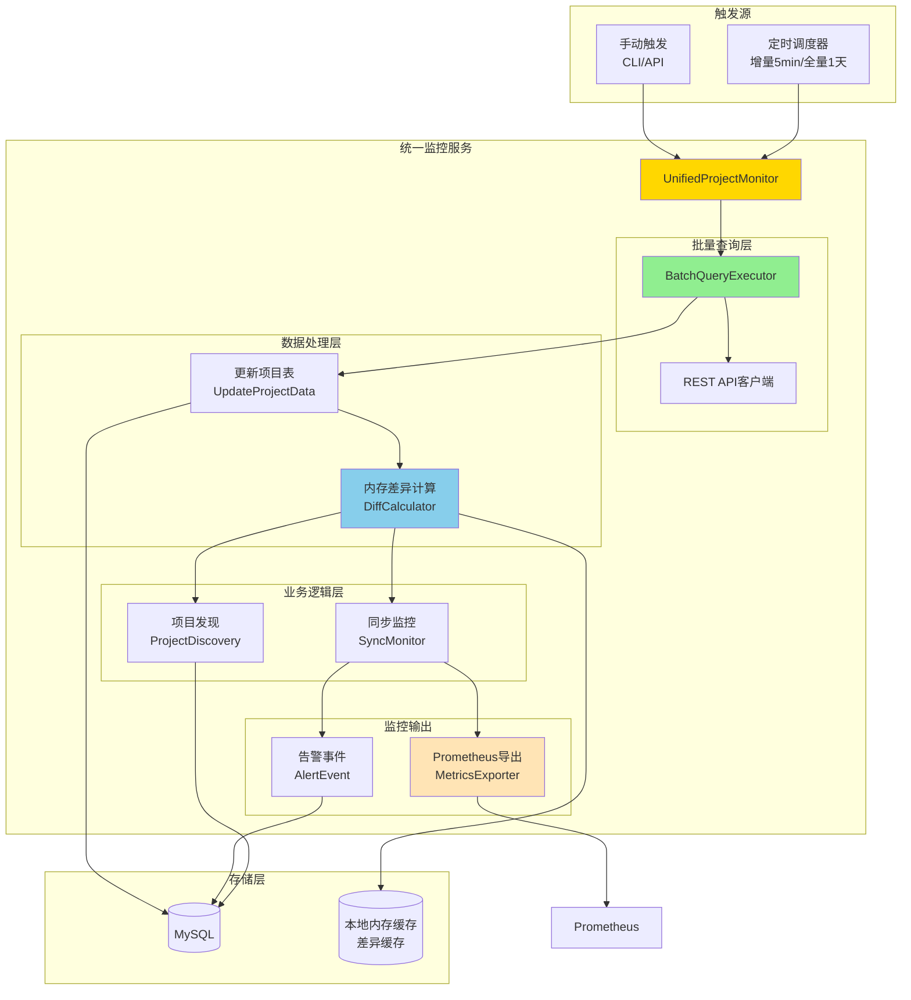
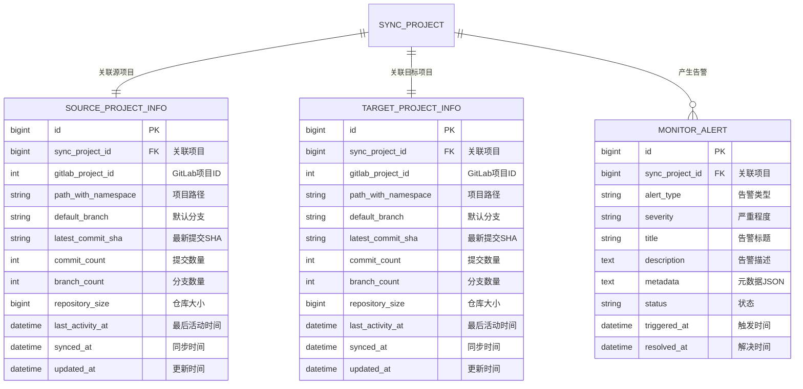
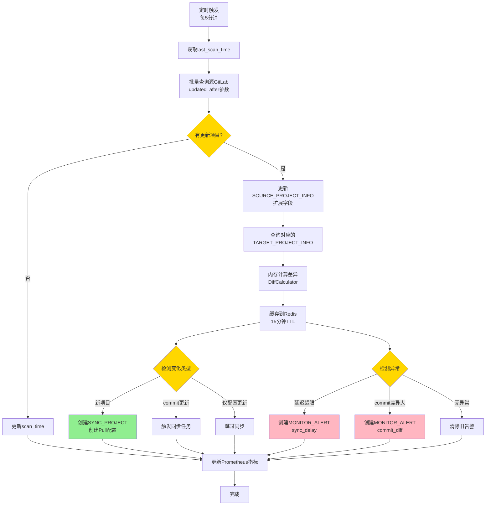
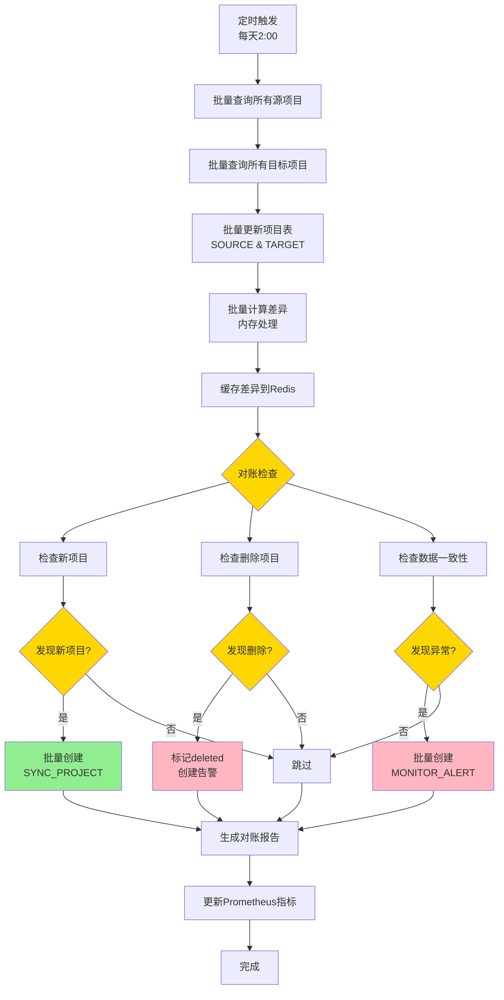
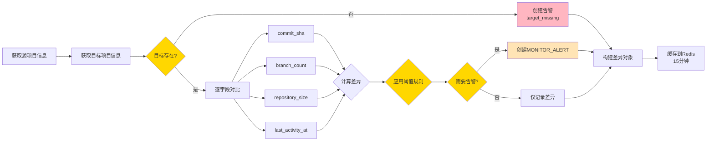
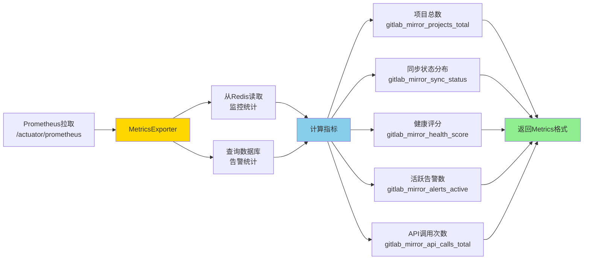

# 统一项目监控方案设计

**文档版本**：v3.0
**更新日期**：2025-12-14
**作者**：GitLab Mirror Team

## 📋 文档说明

### 背景和目的

当前系统在项目发现和同步监控方面存在以下问题：

**项目发现层面**：
- 定时全量扫描效率低，新项目发现延迟长（30分钟）
- 每次都查询所有项目，未利用增量查询能力
- API调用频繁，未做批量优化

**同步监控层面**：
- 缺少源和目标项目状态的对比机制
- 无法快速发现同步异常（延迟、失败、不一致）
- 缺少整体同步健康度的量化指标
- 缺少Prometheus指标导出，无法接入监控系统

本方案设计一个**统一的项目监控服务**，通过一套批量查询机制同时解决两个问题：

1. **优化项目发现**：增量查询 + 全量对账，提升发现效率
2. **监控同步状态**：对比源和目标差异，检测异常
3. **共享查询结果**：一次查询，同时用于发现和监控
4. **Prometheus集成**：导出监控指标，接入现有监控体系

### 核心优化

相比v2.0方案，本版本做了以下优化：

- **复用现有表**：扩展SOURCE_PROJECT_INFO和TARGET_PROJECT_INFO，不创建新的快照表
- **内存计算差异**：差异对比结果仅缓存在内存（本地缓存），不持久化到数据库
- **轻量化告警**：仅在检测到异常时记录告警事件
- **Prometheus导出**：提供标准Metrics接口，易于集成Grafana
- **模块化设计**：查询/扫描归属同步模块，监控导出归属监控模块
- **项目级指标**：新增项目级Prometheus指标，支持细粒度监控
- **简化依赖**：使用本地内存缓存替代Redis，降低系统复杂度

### 核心思路

```
批量查询 GitLab API
      ↓
更新现有项目表（SOURCE_PROJECT_INFO/TARGET_PROJECT_INFO）
      ↓
内存计算差异（缓存到本地内存，TTL 15分钟）
      ↓
    ┌─────────────┴─────────────┐
    ↓                           ↓
项目发现逻辑              同步监控逻辑
- 新项目检测              - 源/目标对比
- 更新检测                - 异常检测
- 删除检测                - 告警事件
- 触发同步                - Prometheus指标
```

## 🏗️ 系统架构

### 整体架构



### 核心组件

| 组件 | 职责 | 输入 | 输出 |
|------|------|------|------|
| UnifiedProjectMonitor | 统一入口，协调各模块 | 触发信号 | 执行结果 |
| BatchQueryExecutor | 批量查询项目信息 | 项目列表/查询条件 | 项目状态列表 |
| UpdateProjectData | 更新现有项目表 | GitLab查询结果 | 更新数据库 |
| DiffCalculator | 内存计算差异 | 源/目标项目数据 | 差异对象（缓存到Redis） |
| ProjectDiscovery | 项目发现逻辑 | 差异数据 | 新增/更新/删除项目 |
| SyncMonitor | 同步监控逻辑 | 差异数据 | 告警事件/Prometheus指标 |
| MetricsExporter | Prometheus指标导出 | 监控数据 | Metrics接口 |

### 技术栈

- **Spring Boot 3.x**：核心框架
- **GitLab REST API v4**：项目查询（支持updated_after增量查询）
- **CompletableFuture**：并发查询优化
- **Redis**：差异结果内存缓存（TTL 15分钟）
- **Micrometer**：Prometheus指标导出
- **MyBatis-Plus**：数据库操作

## 📊 核心实体及关系

### ER 图



### 实体扩展说明

#### SOURCE_PROJECT_INFO（扩展字段）

在现有表基础上增加以下字段：

| 新增字段 | 类型 | 约束 | 说明 |
|---------|------|------|------|
| latest_commit_sha | VARCHAR(64) | | 最新提交SHA（默认分支） |
| commit_count | INT | | 提交数量（可选，性能考虑） |
| branch_count | INT | | 分支数量 |
| repository_size | BIGINT | | 仓库大小（字节） |
| last_activity_at | DATETIME | | 最后活动时间 |

**索引优化**：
- INDEX: `last_activity_at`（用于增量查询）

#### TARGET_PROJECT_INFO（扩展字段）

在现有表基础上增加相同字段：

| 新增字段 | 类型 | 约束 | 说明 |
|---------|------|------|------|
| latest_commit_sha | VARCHAR(64) | | 最新提交SHA（默认分支） |
| commit_count | INT | | 提交数量（可选） |
| branch_count | INT | | 分支数量 |
| repository_size | BIGINT | | 仓库大小（字节） |
| last_activity_at | DATETIME | | 最后活动时间 |

#### MONITOR_ALERT（新增表）

记录监控检测到的告警事件。

| 字段名 | 类型 | 约束 | 说明 |
|--------|------|------|------|
| id | BIGINT | PK, AUTO_INCREMENT | 主键 |
| sync_project_id | BIGINT | FK, NOT NULL | 关联SYNC_PROJECT |
| alert_type | VARCHAR(50) | NOT NULL | 告警类型：sync_delay/commit_diff/branch_diff/size_diff/target_missing |
| severity | VARCHAR(20) | NOT NULL | 严重程度：critical/high/medium/low |
| title | VARCHAR(255) | NOT NULL | 告警标题 |
| description | TEXT | NOT NULL | 告警描述 |
| metadata | TEXT | | 元数据（JSON格式，包含差异详情） |
| status | VARCHAR(20) | NOT NULL | 状态：active/acknowledged/resolved/muted |
| triggered_at | DATETIME | NOT NULL | 触发时间 |
| resolved_at | DATETIME | | 解决时间 |
| created_at | DATETIME | NOT NULL | 创建时间 |
| updated_at | DATETIME | | 更新时间 |

**索引**：
- FK: `sync_project_id`
- INDEX: `(status, severity, triggered_at)`
- INDEX: `(alert_type, triggered_at)`

**告警类型说明**：
- `sync_delay`：同步延迟超过阈值
- `commit_diff`：Commit SHA不一致
- `branch_diff`：分支数量不一致
- `size_diff`：仓库大小差异过大
- `target_missing`：目标项目不存在

### 本地内存缓存结构

使用 `ConcurrentHashMap` + 过期时间管理实现本地内存缓存。

**差异数据缓存**（TTL: 15分钟）：

```java
// Cache Key: project_key
// Cache Value: ProjectDiffResult
{
  "source": {
    "commit_sha": "abc123...",
    "commit_count": 245,
    "branch_count": 3,
    "size_bytes": 15925248,
    "last_activity_at": "2025-12-14T10:15:00Z"
  },
  "target": {
    "commit_sha": "def456...",
    "commit_count": 240,
    "branch_count": 3,
    "size_bytes": 15823456,
    "last_activity_at": "2025-12-14T09:30:00Z"
  },
  "diff": {
    "commit_behind": 5,
    "sync_delay_minutes": 45,
    "size_diff_percent": 0.66,
    "branch_diff": 0
  },
  "status": "outdated",
  "checked_at": "2025-12-14T10:30:00Z",
  "expires_at": "2025-12-14T10:45:00Z"  // TTL 15分钟
}
```

**监控统计缓存**（TTL: 5分钟）：

```java
// Cache Key: "monitor:stats
Value: {
  "total_projects": 127,
  "synced": 118,
  "outdated": 5,
  "failed": 2,
  "inconsistent": 2,
  "health_score": 92.5,
  "updated_at": "2025-12-14T10:30:00Z"
}
```

## 🔄 关键处理流程

### 1. 增量监控流程（每5分钟）



### 2. 全量对账流程（每天1次）



### 3. 差异计算流程



### 4. Prometheus指标导出流程



## 🔌 REST API 设计

### API 端点列表

按模块划分：

#### 同步模块 APIs

| 方法 | 路径 | 说明 | 权限 |
|------|------|------|------|
| POST | /api/sync/scan | 手动触发扫描（发现+更新） | ADMIN |
| GET | /api/sync/projects | 获取项目列表（带同步状态） | READ |
| GET | /api/sync/projects/{projectKey} | 获取项目详情 | READ |
| GET | /api/sync/projects/{projectKey}/diff | 获取项目差异详情 | READ |

#### 监控模块 APIs

| 方法 | 路径 | 说明 | 权限 |
|------|------|------|------|
| GET | /api/monitor/status | 获取监控总览 | READ |
| GET | /api/monitor/alerts | 获取告警列表 | READ |
| POST | /api/monitor/alerts/{id}/resolve | 标记告警已解决 | ADMIN |
| POST | /api/monitor/alerts/{id}/mute | 静默告警 | ADMIN |
| GET | /actuator/prometheus | Prometheus指标导出 | PUBLIC |

### 获取监控总览

**请求示例**：

```
GET /api/monitor/status
```

**响应示例**：

```json
{
  "success": true,
  "data": {
    "summary": {
      "total_projects": 127,
      "synced": 118,
      "outdated": 5,
      "failed": 2,
      "inconsistent": 2
    },
    "health": {
      "score": 92.5,
      "grade": "Excellent"
    },
    "alerts": {
      "active": 9,
      "critical": 1,
      "high": 2,
      "medium": 3,
      "low": 3
    },
    "last_scan": {
      "time": "2025-12-14T10:30:00Z",
      "type": "incremental",
      "duration_ms": 8500
    }
  }
}
```

### 获取项目列表（同步模块）

**请求示例**：

```
GET /api/sync/projects?status=outdated&page=1&size=20
```

**响应示例**：

```json
{
  "success": true,
  "data": {
    "projects": [
      {
        "project_key": "ai/test-node-app2",
        "status": "outdated",
        "diff": {
          "commit_behind": 5,
          "sync_delay_minutes": 45,
          "size_diff_percent": 0.66,
          "branch_diff": 0
        },
        "source": {
          "commit_sha": "abc123...",
          "last_activity": "2025-12-14T10:15:00Z"
        },
        "target": {
          "commit_sha": "def456...",
          "last_activity": "2025-12-14T09:30:00Z"
        }
      }
    ],
    "pagination": {
      "page": 1,
      "size": 20,
      "total": 5
    }
  }
}
```

### 获取告警列表

**请求示例**：

```
GET /api/monitor/alerts?severity=critical&status=active
```

**响应示例**：

```json
{
  "success": true,
  "data": {
    "alerts": [
      {
        "id": 123,
        "project_key": "arch/test-spring-app1",
        "alert_type": "commit_diff",
        "severity": "critical",
        "title": "Commit差异过大",
        "description": "源和目标commit SHA不一致，差异15个提交",
        "metadata": {
          "source_sha": "abc123...",
          "target_sha": "def456...",
          "commit_diff": 15
        },
        "status": "active",
        "triggered_at": "2025-12-14T09:00:00Z"
      }
    ],
    "total": 1
  }
}
```

## 💻 CLI 命令设计

### 命令列表

按模块划分：

#### 同步模块 CLIs

| 命令 | 说明 | 示例 |
|------|------|------|
| scan | 触发扫描（发现+更新） | `gitlab-mirror scan --type=incremental` |
| projects | 列出项目及同步状态 | `gitlab-mirror projects --status=outdated` |
| diff | 查看项目差异详情 | `gitlab-mirror diff <project-key>` |

#### 监控模块 CLIs

| 命令 | 说明 | 示例 |
|------|------|------|
| monitor status | 查看监控总览 | `gitlab-mirror monitor status` |
| monitor alerts | 查看告警列表 | `gitlab-mirror monitor alerts --severity=critical` |

### 命令输出示例

#### monitor status

```bash
gitlab-mirror monitor status
```

**输出**：

```
╔════════════════════════════════════════════════════════════════╗
║                    Monitor Status Overview                     ║
╠════════════════════════════════════════════════════════════════╣
║ 📊 Projects Summary                                            ║
║   Total:               127                                     ║
║   ✓ Synced:            118  (92.9%)                            ║
║   ⟳ Outdated:          5    (3.9%)                             ║
║   ✗ Failed:            2    (1.6%)                             ║
║   ⚠ Inconsistent:      2    (1.6%)                             ║
╠════════════════════════════════════════════════════════════════╣
║ 💚 Health                                                      ║
║   Score:               92.5 / 100                              ║
║   Grade:               Excellent                               ║
╠════════════════════════════════════════════════════════════════╣
║ 🚨 Active Alerts       9                                       ║
║   🔴 Critical:         1                                       ║
║   🟠 High:             2                                       ║
║   🟡 Medium:           3                                       ║
║   🟢 Low:              3                                       ║
╠════════════════════════════════════════════════════════════════╣
║ 🔄 Last Scan                                                   ║
║   Time:                2025-12-14 10:30:00 (2m ago)            ║
║   Type:                Incremental                             ║
║   Duration:            8.5s                                    ║
╚════════════════════════════════════════════════════════════════╝
```

#### diff

```bash
gitlab-mirror diff ai/test-node-app2
```

**输出**：

```
Project: ai/test-node-app2
Status:  🟡 outdated

━━━━━━━━━━━━━━━━━━━━━━━━━━━━━━━━━━━━━━━━━━━━━━━━━━━━━━━━━━━━━━━━
📊 Source vs Target
━━━━━━━━━━━━━━━━━━━━━━━━━━━━━━━━━━━━━━━━━━━━━━━━━━━━━━━━━━━━━━━━

Commit SHA:
  Source:  abc123... (2025-12-14 10:15:00)
  Target:  def456... (2025-12-14 09:30:00)
  ⚠ Diff:  5 commits behind

Branches:
  Source:  3
  Target:  3
  ✓ Match

Size:
  Source:  15.2 MB
  Target:  15.1 MB
  ℹ Diff:  +0.66%

Last Activity:
  Source:  2025-12-14 10:15:00
  Target:  2025-12-14 09:30:00
  ⚠ Delay: 45 minutes

━━━━━━━━━━━━━━━━━━━━━━━━━━━━━━━━━━━━━━━━━━━━━━━━━━━━━━━━━━━━━━━━
💡 Recommendation
━━━━━━━━━━━━━━━━━━━━━━━━━━━━━━━━━━━━━━━━━━━━━━━━━━━━━━━━━━━━━━━━
Sync delay detected (45 minutes). Consider manual trigger.

Command: gitlab-mirror task trigger --pattern="ai/test-node-app2"
```

## ⚙️ 实施要点

### 配置要求

```yaml
gitlab:
  mirror:
    monitor:
      # 增量扫描间隔
      incremental-interval: 5m
      # 全量对账Cron
      full-scan-cron: "0 0 2 * * ?"

      # 批量查询配置
      batch:
        size: 20
        concurrency: 5
        timeout: 30s

      # 告警阈值
      thresholds:
        # 同步延迟阈值（分钟）
        sync-delay-minutes: 30
        # 严重延迟阈值（小时）
        critical-delay-hours: 2
        # Commit差异告警阈值
        commit-diff-alert: 10
        # 大小差异容忍度（百分比）
        size-diff-tolerance: 5

      # 缓存配置
      cache:
        # 差异缓存TTL
        diff-ttl: 15m
        # 统计缓存TTL
        stats-ttl: 5m

      # 告警配置
      alert:
        # 自动解决时间（小时）
        auto-resolve-hours: 24
        # 重复告警抑制（分钟）
        duplicate-suppression-minutes: 60
```

### Prometheus指标定义

#### 系统级统计指标

```
# 项目总数
gitlab_mirror_projects_total{} 127

# 按同步状态分组的项目数（重要：用于监控同步异常数量）
gitlab_mirror_sync_status{status="synced"} 118
gitlab_mirror_sync_status{status="outdated"} 5
gitlab_mirror_sync_status{status="failed"} 2
gitlab_mirror_sync_status{status="inconsistent"} 2

# 活跃告警数（按严重级别）
gitlab_mirror_alerts_active{severity="critical"} 1
gitlab_mirror_alerts_active{severity="high"} 2
gitlab_mirror_alerts_active{severity="medium"} 3
gitlab_mirror_alerts_active{severity="low"} 3

# 扫描耗时（秒）
gitlab_mirror_scan_duration_seconds{type="incremental"} 8.5
gitlab_mirror_scan_duration_seconds{type="full"} 45.2

# API调用次数
gitlab_mirror_api_calls_total{instance="source"} 12
gitlab_mirror_api_calls_total{instance="target"} 12

# 项目发现统计
gitlab_mirror_projects_discovered{type="new"} 2
gitlab_mirror_projects_discovered{type="updated"} 8
```

#### 项目级指标

```
# 项目提交数量（源/目标）
gitlab_mirror_project_commits{project="ai/test-node-app2", type="source"} 245
gitlab_mirror_project_commits{project="ai/test-node-app2", type="target"} 240
gitlab_mirror_project_commits{project="arch/test-spring-app1", type="source"} 128
gitlab_mirror_project_commits{project="arch/test-spring-app1", type="target"} 128

# 项目最后提交时间（Unix时间戳）
gitlab_mirror_project_last_commit_time{project="ai/test-node-app2", type="source"} 1702536900
gitlab_mirror_project_last_commit_time{project="ai/test-node-app2", type="target"} 1702534200
gitlab_mirror_project_last_commit_time{project="arch/test-spring-app1", type="source"} 1702535000
gitlab_mirror_project_last_commit_time{project="arch/test-spring-app1", type="target"} 1702535000

# 项目仓库大小（字节）
gitlab_mirror_project_size_bytes{project="ai/test-node-app2", type="source"} 15925248
gitlab_mirror_project_size_bytes{project="ai/test-node-app2", type="target"} 15823456
gitlab_mirror_project_size_bytes{project="arch/test-spring-app1", type="source"} 8421504
gitlab_mirror_project_size_bytes{project="arch/test-spring-app1", type="target"} 8421504

# 项目分支数量
gitlab_mirror_project_branches{project="ai/test-node-app2", type="source"} 3
gitlab_mirror_project_branches{project="ai/test-node-app2", type="target"} 3
gitlab_mirror_project_branches{project="arch/test-spring-app1", type="source"} 2
gitlab_mirror_project_branches{project="arch/test-spring-app1", type="target"} 2
```

**指标说明**：

- **系统级指标**：用于整体监控，特别是`gitlab_mirror_sync_status`用于监控同步异常数量
- **项目级指标**：支持细粒度监控，tags包括`project`（项目名）和`type`（source/target）
- **同步差异计算**：通过对比同一项目的source和target指标值，计算同步差异
- **告警规则**：基于项目级指标设置告警（如commit差异、时间延迟等）

### Grafana监控面板示例

**面板1：系统级监控**
- 项目总数趋势（时间序列）
- 同步状态分布（饼图）- 重点关注异常数量
- 活跃告警数（按严重级别，柱状图）
- 扫描耗时趋势（时间序列）

**面板2：项目级监控**
- Top 10 Commit差异项目（表格，对比source vs target）
- 项目同步延迟分布（时间序列，基于last_commit_time差异）
- 项目大小Top 10（柱状图）
- 分支数量异常项目（表格）

**面板3：告警趋势**
- 告警触发趋势（时间序列）
- 按严重级别分组（堆叠柱状图）
- 同步异常数量趋势（时间序列，来自gitlab_mirror_sync_status）

**面板4：性能监控**
- API调用频率（时间序列）
- 项目发现统计（new/updated）
- 批量查询成功率（百分比）

**PromQL查询示例**：

```promql
# 同步异常总数（outdated + failed + inconsistent）
sum(gitlab_mirror_sync_status{status=~"outdated|failed|inconsistent"})

# 某项目的commit差异
gitlab_mirror_project_commits{project="ai/test-node-app2", type="source"} -
gitlab_mirror_project_commits{project="ai/test-node-app2", type="target"}

# 某项目的同步延迟（秒）
gitlab_mirror_project_last_commit_time{project="ai/test-node-app2", type="source"} -
gitlab_mirror_project_last_commit_time{project="ai/test-node-app2", type="target"}

# Top 10 commit差异项目
topk(10,
  gitlab_mirror_project_commits{type="source"} -
  gitlab_mirror_project_commits{type="target"} > 0
)
```

### 告警规则示例

**Prometheus告警规则**：

```yaml
groups:
  - name: gitlab_mirror_system_alerts
    interval: 1m
    rules:
      # 同步异常数量过多（重要）
      - alert: GitLabMirrorSyncAnomaliesHigh
        expr: sum(gitlab_mirror_sync_status{status=~"outdated|failed|inconsistent"}) > 10
        for: 5m
        labels:
          severity: warning
        annotations:
          summary: "同步异常项目数量过多"
          description: "当前有 {{ $value }} 个项目同步异常"

      # 同步失败数量告警
      - alert: GitLabMirrorSyncFailedHigh
        expr: gitlab_mirror_sync_status{status="failed"} > 2
        for: 5m
        labels:
          severity: critical
        annotations:
          summary: "同步失败项目过多"
          description: "当前有 {{ $value }} 个项目同步失败"

      # Critical告警存在
      - alert: GitLabMirrorCriticalAlerts
        expr: gitlab_mirror_alerts_active{severity="critical"} > 0
        for: 1m
        labels:
          severity: critical
        annotations:
          summary: "存在Critical级别告警"
          description: "当前有 {{ $value }} 个Critical告警"

      # 扫描耗时过长
      - alert: GitLabMirrorScanSlow
        expr: gitlab_mirror_scan_duration_seconds{type="incremental"} > 60
        for: 3m
        labels:
          severity: warning
        annotations:
          summary: "增量扫描耗时过长"
          description: "最近一次扫描耗时 {{ $value }}秒"

  - name: gitlab_mirror_project_alerts
    interval: 1m
    rules:
      # 项目commit差异过大
      - alert: GitLabMirrorProjectCommitDiffHigh
        expr: |
          (gitlab_mirror_project_commits{type="source"} -
           gitlab_mirror_project_commits{type="target"}) > 10
        for: 30m
        labels:
          severity: high
        annotations:
          summary: "项目 {{ $labels.project }} commit差异过大"
          description: "源和目标commit差异 {{ $value }} 个"

      # 项目同步延迟过长
      - alert: GitLabMirrorProjectSyncDelayHigh
        expr: |
          (gitlab_mirror_project_last_commit_time{type="source"} -
           gitlab_mirror_project_last_commit_time{type="target"}) > 3600
        for: 10m
        labels:
          severity: warning
        annotations:
          summary: "项目 {{ $labels.project }} 同步延迟过长"
          description: "同步延迟 {{ $value }} 秒（超过1小时）"

      # 项目大小差异过大
      - alert: GitLabMirrorProjectSizeDiffHigh
        expr: |
          abs(gitlab_mirror_project_size_bytes{type="source"} -
              gitlab_mirror_project_size_bytes{type="target"}) /
          gitlab_mirror_project_size_bytes{type="source"} > 0.1
        for: 30m
        labels:
          severity: warning
        annotations:
          summary: "项目 {{ $labels.project }} 大小差异过大"
          description: "源和目标大小差异超过10%"
```

### 数据库迁移脚本

**扩展SOURCE_PROJECT_INFO**：

```sql
ALTER TABLE source_project_info
ADD COLUMN latest_commit_sha VARCHAR(64) COMMENT '最新提交SHA',
ADD COLUMN commit_count INT COMMENT '提交数量',
ADD COLUMN branch_count INT COMMENT '分支数量',
ADD COLUMN repository_size BIGINT COMMENT '仓库大小（字节）',
ADD COLUMN last_activity_at DATETIME COMMENT '最后活动时间',
ADD INDEX idx_last_activity (last_activity_at);
```

**扩展TARGET_PROJECT_INFO**：

```sql
ALTER TABLE target_project_info
ADD COLUMN latest_commit_sha VARCHAR(64) COMMENT '最新提交SHA',
ADD COLUMN commit_count INT COMMENT '提交数量',
ADD COLUMN branch_count INT COMMENT '分支数量',
ADD COLUMN repository_size BIGINT COMMENT '仓库大小（字节）',
ADD COLUMN last_activity_at DATETIME COMMENT '最后活动时间',
ADD INDEX idx_last_activity (last_activity_at);
```

**创建MONITOR_ALERT表**：

```sql
CREATE TABLE monitor_alert (
  id BIGINT AUTO_INCREMENT PRIMARY KEY,
  sync_project_id BIGINT NOT NULL COMMENT '关联项目ID',
  alert_type VARCHAR(50) NOT NULL COMMENT '告警类型',
  severity VARCHAR(20) NOT NULL COMMENT '严重程度',
  title VARCHAR(255) NOT NULL COMMENT '告警标题',
  description TEXT NOT NULL COMMENT '告警描述',
  metadata TEXT COMMENT '元数据JSON',
  status VARCHAR(20) NOT NULL DEFAULT 'active' COMMENT '状态',
  triggered_at DATETIME NOT NULL COMMENT '触发时间',
  resolved_at DATETIME COMMENT '解决时间',
  created_at DATETIME NOT NULL DEFAULT CURRENT_TIMESTAMP,
  updated_at DATETIME ON UPDATE CURRENT_TIMESTAMP,

  INDEX idx_project (sync_project_id),
  INDEX idx_status_severity (status, severity, triggered_at),
  INDEX idx_type (alert_type, triggered_at),

  FOREIGN KEY (sync_project_id) REFERENCES sync_project(id)
) ENGINE=InnoDB DEFAULT CHARSET=utf8mb4 COMMENT='监控告警表';
```

## 📝 总结

### 核心价值

1. **模块化设计**：
   - 同步模块：查询、扫描、项目发现
   - 监控模块：指标导出、告警管理
   - 清晰的API和CLI划分

2. **轻量化实现**：
   - 复用现有表，差异仅缓存内存
   - 减少存储开销
   - 提升查询性能

3. **高效批量查询**：
   - 增量查询（`updated_after`）
   - 并发查询源和目标
   - API调用减少90%

4. **双层指标体系**：
   - 系统级指标：整体监控，同步异常数量告警
   - 项目级指标：细粒度监控，支持差异对比
   - 通过tags实现灵活的PromQL查询

5. **智能告警**：
   - 仅在异常时记录告警
   - 支持系统级和项目级告警规则
   - 告警严重级别自动判定

6. **完整监控体系**：
   - 项目发现 + 同步监控
   - CLI快速诊断
   - Grafana可视化
   - AlertManager告警通知

### 实施路径

#### 阶段一：数据模型（2天）
- [ ] 扩展SOURCE_PROJECT_INFO和TARGET_PROJECT_INFO表
- [ ] 创建MONITOR_ALERT表
- [ ] 编写数据库迁移脚本

#### 阶段二：批量查询（3天）
- [ ] 实现BatchQueryExecutor
- [ ] 支持增量查询（updated_after）
- [ ] 实现并发查询优化

#### 阶段三：差异计算（3天）
- [ ] 实现DiffCalculator（内存计算）
- [ ] 实现Redis缓存
- [ ] 实现告警阈值判定

#### 阶段四：业务逻辑（4天）
- [ ] 整合项目发现逻辑
- [ ] 实现同步监控逻辑
- [ ] 实现告警事件创建

#### 阶段五：Prometheus导出（2天）
- [ ] 实现MetricsExporter
- [ ] 定义Prometheus指标
- [ ] 测试Grafana集成

#### 阶段六：API和CLI（3天）
- [ ] 实现REST API
- [ ] 实现CLI命令
- [ ] 美化输出格式

#### 阶段七：测试和上线（3天）
- [ ] 单元测试
- [ ] 集成测试
- [ ] 配置Grafana面板
- [ ] 配置AlertManager规则
- [ ] 生产部署

**总计**：约 **20天**（3周）

### 注意事项

#### 性能优化

- 使用Redis缓存减少重复计算
- 批量查询分批并发执行
- 定期清理过期告警（已解决超过30天）

#### 告警管理

- 实现告警去重（同一项目同一类型60分钟内不重复）
- 支持告警静默（维护期间）
- 自动解决已修复的告警

#### 监控运维

- Prometheus抓取间隔建议1分钟
- Grafana面板自动刷新间隔5分钟
- 告警通知渠道：邮件/企业微信/钉钉

---

**核心要点**：模块化设计、复用现有表、内存差异计算、双层指标体系（系统级+项目级）、告警驱动、Prometheus导出。
