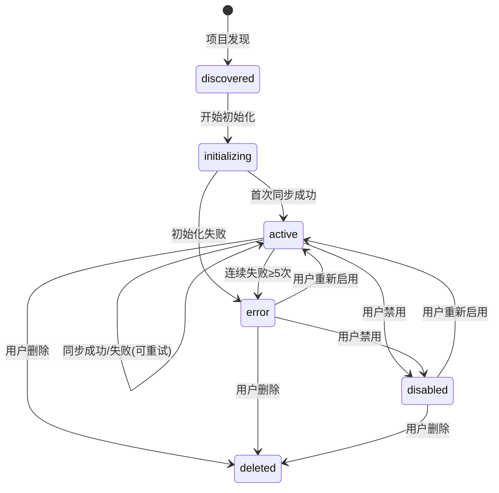
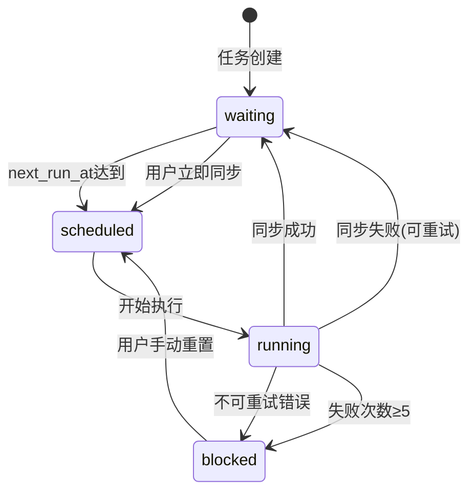
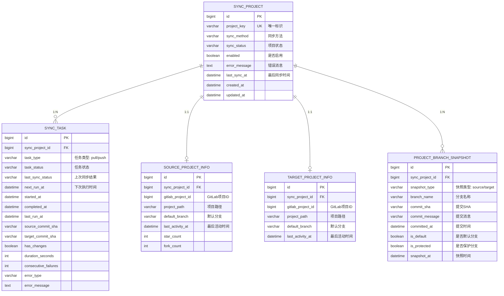

# 状态机设计文档

## 概述

系统中存在三个独立的状态维度，它们各自反映不同的关注点：

1. **项目状态 (Project Status)** - `sync_project.sync_status`：反映项目的生命周期状态
2. **任务状态 (Task Status)** - `sync_task.task_status`：反映同步任务的执行状态
3. **差异状态 (Diff Status)** - 运行时计算：反映源目标仓库的数据差异

---

## 1. 项目状态 (Project Status)

### 1.1 状态定义

项目状态反映项目在系统中的**生命周期阶段**，与同步执行无关。

| 状态 | 值 | 说明 | 是否可同步 |
|-----|---|------|-----------|
| **已发现** | `discovered` | 项目刚被发现，等待初始化 | ❌ |
| **初始化中** | `initializing` | 正在创建目标项目和配置 | ✅ |
| **活跃** | `active` | 项目正常运行，可以执行同步 | ✅ |
| **错误** | `error` | 遇到严重错误，需人工介入 | ❌ |
| **已禁用** | `disabled` | 用户手动禁用 | ❌ |
| **已删除** | `deleted` | 逻辑删除（保留历史） | ❌ |

### 1.2 状态转换图



### 1.3 状态转换规则

| 当前状态 | 触发条件 | 新状态 | 触发方式 |
|---------|---------|--------|---------|
| `discovered` | 开始创建目标项目 | `initializing` | 自动 |
| `initializing` | 首次同步成功 | `active` | 自动 |
| `initializing` | 初始化失败（连续失败≥3次） | `error` | 自动 |
| `active` | 同步成功 | `active` | 自动（保持） |
| `active` | 同步失败（可重试，失败<5次） | `active` | 自动（保持） |
| `active` | 连续失败≥5次 | `error` | 自动 |
| `active` | 用户禁用 | `disabled` | 手动 |
| `error` | 用户点击"重新启用" | `active` | 手动 |
| `disabled` | 用户点击"启用" | `active` | 手动 |
| `*` | 用户删除项目 | `deleted` | 手动 |

**注意**：源项目不存在的情况由**差异状态**反映，不改变项目状态。任务会被阻塞，但项目保持 `active` 状态。

### 1.4 关键字段

| 字段 | 类型 | 说明 |
|-----|------|------|
| `sync_status` | VARCHAR(50) | 项目状态：discovered/initializing/active/error/disabled/deleted |
| `enabled` | BOOLEAN | 是否启用（用户控制） |
| `error_message` | TEXT | 错误消息 |
| `last_sync_at` | DATETIME | 最后成功同步时间 |

---

## 2. 任务状态 (Task Status)

### 2.1 状态定义

任务状态反映同步任务的**实时执行状态**，与调度器和执行器交互。

| 状态 | 值 | 说明 | 下一步 |
|-----|---|------|--------|
| **等待中** | `waiting` | 等待调度器选中 | 到达next_run_at时被调度 |
| **已调度** | `scheduled` | 已被调度器选中，等待执行器 | 执行器接管，开始执行 |
| **运行中** | `running` | 正在执行同步 | 执行完成，转waiting/blocked |
| **阻塞** | `blocked` | 被阻塞，需人工介入 | 用户手动重置 |

### 2.2 状态转换图



### 2.3 辅助状态字段

除了 `task_status`，还有一个关键的辅助字段：

**last_sync_status**: 上次同步结果（仅在执行后有意义）

| 值 | 说明 |
|---|------|
| `success` | 上次同步成功 |
| `failed` | 上次同步失败 |
| `skipped` | 上次同步跳过（无变化） |
| `null` | 从未执行过 |

### 2.4 状态转换规则

| 当前状态 | 触发条件 | 新状态 | last_sync_status | next_run_at |
|---------|---------|--------|------------------|-------------|
| `waiting` | next_run_at <= NOW() | `scheduled` | 保持 | 保持 |
| `scheduled` | 执行器开始执行 | `running` | 保持 | 保持 |
| `running` | 同步成功 | `waiting` | `success` | now + interval |
| `running` | 同步失败（可重试） | `waiting` | `failed` | now + backoff |
| `running` | 无变化，跳过同步 | `waiting` | `skipped` | now + interval |
| `running` | 不可重试错误 | `blocked` | `failed` | null |
| `running` | consecutive_failures ≥ 5 | `blocked` | `failed` | null |
| `blocked` | 用户手动触发 | `scheduled` | null | now |
| `waiting` | 用户手动触发 | `scheduled` | 保持 | now |

### 2.5 关键字段

| 字段 | 类型 | 说明 |
|-----|------|------|
| `task_status` | VARCHAR(50) | 任务状态：waiting/scheduled/running/blocked |
| `last_sync_status` | VARCHAR(50) | 上次同步结果：success/failed/skipped/null |
| `next_run_at` | DATETIME | 下次执行时间 |
| `started_at` | DATETIME | 本次开始时间 |
| `completed_at` | DATETIME | 本次完成时间 |
| `last_run_at` | DATETIME | 上次执行时间 |
| `source_commit_sha` | VARCHAR(255) | 源提交SHA |
| `target_commit_sha` | VARCHAR(255) | 目标提交SHA |
| `has_changes` | BOOLEAN | 是否有变化 |
| `duration_seconds` | INT | 执行耗时 |
| `consecutive_failures` | INT | 连续失败次数 |
| `error_type` | VARCHAR(50) | 错误类型 |
| `error_message` | TEXT | 错误消息 |

---

## 3. 差异状态 (Diff Status)

### 3.1 状态定义

差异状态是**运行时计算**的结果，反映源仓库和目标仓库之间的数据差异，不存储在数据库中。

| 状态 | 值 | 说明 | UI显示 |
|-----|---|------|--------|
| **同步** | `synced` | 源和目标完全一致 | 🟢 绿色 |
| **落后** | `outdated` | 目标落后于源，需要同步 | 🟡 黄色 |
| **领先** | `ahead` | 目标领先于源，可能有本地提交 | 🟠 橙色 |
| **分裂** | `diverged` | 源和目标都有独立提交，历史已分叉 | 🔴 红色 |
| **未知** | `unknown` | 无法确定差异（未扫描或扫描失败） | ⚪ 灰色 |
| **目标缺失** | `target_missing` | 目标项目尚未创建 | 🔵 蓝色 |
| **源缺失** | `source_missing` | 源项目不存在或已删除 | ⚠️ 黄色 |

### 3.2 计算逻辑

差异状态通过以下数据源计算：

1. **项目分支快照表** (`project_branch_snapshot`) - 存储源和目标分支的快照
2. **源项目信息** (`source_project_info`) - 源项目元数据
3. **目标项目信息** (`target_project_info`) - 目标项目元数据

**计算步骤**：

1. 检查源项目是否存在 → 不存在返回 `source_missing`
2. 检查目标项目是否存在 → 不存在返回 `target_missing`
3. 获取源和目标分支快照
4. 若快照为空 → 返回 `unknown`
5. 比对分支差异（按分支逐一比较）：
   - 若完全一致 → 返回 `synced`
   - 若存在分裂分支 → 返回 `diverged`（最高优先级，需人工处理）
   - 若存在目标领先的分支 → 返回 `ahead`
   - 若仅存在目标落后的分支 → 返回 `outdated`

**判断依据**：

1. **提交时间比较**：`committed_at` 时间戳
   - `target.committed_at > source.committed_at` → 目标可能领先
   - `target.committed_at < source.committed_at` → 目标可能落后

2. **分裂检测**（同一分支）：
   - SHA 不同 **且** 两边都有独立提交（无法快进合并） → `diverged`
   - 检测方式：比较提交历史，判断是否存在共同祖先但各自有新提交

**优先级**：`diverged` > `ahead` > `outdated` > `synced`

### 3.3 差异检测维度

差异检测包含多个维度：

#### 3.3.1 分支级别差异

| 类型 | 说明 | 判定依据 |
|-----|------|---------|
| **新增分支** | 源有，目标无 | source_branches ∉ target_branches |
| **删除分支** | 源无，目标有 | target_branches ∉ source_branches |
| **同步** | 分支存在，SHA一致 | source_sha = target_sha |
| **目标落后** | 分支存在，目标落后于源 | source_sha ≠ target_sha 且 source_time > target_time |
| **目标领先** | 分支存在，目标领先于源 | source_sha ≠ target_sha 且 target_time > source_time |
| **分裂** | 分支存在，双方都有独立提交 | source_sha ≠ target_sha 且无法快进合并 |

#### 3.3.2 项目级别差异

| 维度 | 说明 | 数据源 |
|-----|------|--------|
| **分支数量** | 源和目标分支总数 | COUNT(branches) |
| **默认分支SHA** | 默认分支的最新提交 | default_branch.commit_sha |
| **最后活动时间** | 最后一次提交时间 | last_activity_at |

### 3.4 差异数据结构

#### ProjectDiff（项目级别差异）

| 字段 | 类型 | 说明 |
|-----|------|------|
| `projectKey` | String | 项目唯一标识 |
| `syncProjectId` | Long | 同步项目ID |
| `status` | DiffStatus | 差异状态：synced/outdated/ahead/diverged/unknown/target_missing/source_missing |
| `sourceBranchCount` | Integer | 源分支总数 |
| `targetBranchCount` | Integer | 目标分支总数 |
| `syncedBranchCount` | Integer | 同步的分支数 |
| `outdatedBranchCount` | Integer | 落后的分支数（目标落后于源） |
| `aheadBranchCount` | Integer | 领先的分支数（目标领先于源） |
| `divergedBranchCount` | Integer | 分裂的分支数（双方有独立提交） |
| `missingBranchCount` | Integer | 缺失的分支数 |
| `defaultBranch` | String | 默认分支名 |
| `sourceDefaultSha` | String | 源默认分支SHA |
| `targetDefaultSha` | String | 目标默认分支SHA |
| `defaultBranchStatus` | String | 默认分支状态：synced/outdated/ahead |
| `sourceLastActivityAt` | LocalDateTime | 源最后活动时间 |
| `targetLastActivityAt` | LocalDateTime | 目标最后活动时间 |
| `delaySeconds` | Long | 延迟时间（秒），正数=目标落后，负数=目标领先 |
| `branchDiffs` | List\<BranchDiff\> | 每个分支的差异详情 |

#### BranchDiff（分支级别差异）

| 字段 | 类型 | 说明 |
|-----|------|------|
| `branchName` | String | 分支名称 |
| `status` | String | 分支状态：synced/outdated/ahead/diverged/missing_in_target/extra_in_target |
| `isDefault` | Boolean | 是否为默认分支 |
| `isProtected` | Boolean | 是否为保护分支 |
| `sourceCommitSha` | String | 源提交SHA |
| `sourceCommitMessage` | String | 源提交消息 |
| `sourceCommittedAt` | LocalDateTime | 源提交时间 |
| `targetCommitSha` | String | 目标提交SHA |
| `targetCommitMessage` | String | 目标提交消息 |
| `targetCommittedAt` | LocalDateTime | 目标提交时间 |
| `commitTimeDiffSeconds` | Long | 提交时间差异（秒），正数=目标更新 |
| `canFastForward` | Boolean | 是否可快进合并（用于检测分裂） |

---

## 4. 三个状态的关系

### 4.1 独立性

三个状态是**相互独立**的：

| 状态维度 | 存储位置 | 更新方式 | 反映内容 |
|---------|---------|---------|---------|
| **项目状态** | `sync_project.sync_status` | 状态机转换 | 项目生命周期 |
| **任务状态** | `sync_task.task_status` | 状态机转换 | 同步执行进度 |
| **差异状态** | 运行时计算 | 实时计算 | 数据一致性 |

### 4.2 交互关系

虽然独立，但它们之间有逻辑关联：

```
项目状态 (Project)         任务状态 (Task)         差异状态 (Diff)
     ↓                          ↓                       ↓
  决定能否同步    →     控制同步执行    →      反映同步效果
```

#### 示例场景 1：正常同步

```
Project: active      →  Task: waiting → running → waiting (success)  →  Diff: synced
```

#### 示例场景 2：同步失败（可重试）

```
Project: active      →  Task: waiting → running → waiting (failed)   →  Diff: outdated
```

#### 示例场景 3：连续失败

```
Project: active      →  Task: running → blocked (failed, attempts=5)  →  Diff: outdated
         ↓
Project: error       (自动转换)
```

#### 示例场景 4：源项目不存在

```
Project: active      →  Task: running → blocked (not_found)  →  Diff: source_missing
                        (项目保持active，由Diff状态反映源缺失)
```

### 4.3 UI 展示矩阵

| Project Status | Task Status | Diff Status | UI 显示 | 用户操作 |
|---------------|-------------|-------------|---------|---------|
| `active` | `waiting (success)` | `synced` | 🟢 已同步 | 立即同步 |
| `active` | `waiting (success)` | `outdated` | 🟡 有更新 | 立即同步 |
| `active` | `waiting (success)` | `ahead` | 🟠 目标领先 | 查看详情/强制同步 |
| `active` | `waiting (success)` | `diverged` | 🔴 历史分裂 | 查看详情/手动合并 |
| `active` | `running` | `outdated` | 🔵 同步中... | 无 |
| `active` | `waiting (failed)` | `outdated` | 🟠 同步失败(重试中) | 立即同步 |
| `active` | `blocked` | `outdated` | 🔴 同步失败(已阻塞) | 重置并同步 |
| `active` | `blocked` | `ahead` | ⚠️ 目标领先(已阻塞) | 查看详情/重置 |
| `active` | `blocked` | `diverged` | ❌ 分裂(已阻塞) | 手动解决冲突 |
| `active` | `blocked` | `source_missing` | ⚠️ 源项目缺失 | 检查源项目 |
| `error` | `blocked` | `*` | ❌ 错误 | 重新启用 |
| `disabled` | `*` | `*` | ⏸️ 已禁用 | 启用 |
| `initializing` | `waiting` | `target_missing` | 🔄 初始化中 | 无 |
| `discovered` | `*` | `unknown` | 🆕 已发现 | 触发扫描 |

---

## 5. 实体关系图 (ER Diagram)

### 5.1 核心实体



### 5.2 状态查询策略

#### 5.2.1 项目列表查询

查询项目列表时，需要关联以下表：
- `sync_project` - 获取项目状态
- `sync_task` - 获取任务状态
- `source_project_info` - 检查源项目是否存在
- `target_project_info` - 检查目标项目是否存在
- `project_branch_snapshot` - 计算差异状态

差异状态计算逻辑：
1. 若 `source_project_info.gitlab_project_id` 为空 → `source_missing`
2. 若 `target_project_info.gitlab_project_id` 为空 → `target_missing`
3. 通过比对分支快照的 `commit_sha` 和 `committed_at` 判断：
   - 完全一致 → `synced`
   - 存在分裂分支（双方有独立提交） → `diverged`（最高优先级）
   - 存在目标领先分支 → `ahead`
   - 仅存在目标落后分支 → `outdated`
   - 无快照数据 → `unknown`

**分裂检测**：当同一分支的 SHA 不同时，需进一步判断：
- 若仅通过时间判断无法确定方向，可能是分裂状态
- 理想情况下，需要调用 Git API 检查共同祖先和提交历史
- 简化实现：若存在多个分支，部分领先、部分落后 → `diverged`

#### 5.2.2 过滤查询场景

**场景1：查询需要同步的项目**
- 条件：`sync_status = 'active'` AND `enabled = TRUE` AND 差异状态 = `outdated`

**场景2：查询目标领先的项目**
- 条件：`sync_status = 'active'` AND 差异状态 = `ahead`
- 用途：需要人工检查，确认是否强制同步

**场景3：查询历史分裂的项目**
- 条件：差异状态 = `diverged`
- 用途：需要人工介入，手动解决冲突或重新初始化

---

## 6. 实现检查清单

### 6.1 后端实现

- [ ] 创建 `ProjectStateMachine` - 项目状态机
- [ ] 创建 `TaskStateMachine` - 任务状态机
- [ ] 创建 `DiffCalculator` - 差异计算服务
- [ ] 更新 `PullSyncExecutorService` - 集成状态机
- [ ] 更新 `UnifiedSyncScheduler` - 使用任务状态机
- [ ] 更新 `SyncProject` 实体 - 添加新状态常量
- [ ] 更新 `SyncTask` 实体 - 添加新状态常量
- [ ] 创建数据库索引 - 优化状态查询性能

### 6.2 API 更新

- [ ] `GET /api/sync/projects` - 返回三个状态维度
- [ ] `GET /api/sync/projects/{id}/overview` - 返回详细差异状态
- [ ] `POST /api/sync/projects/{id}/reset` - 重置阻塞任务
- [ ] `POST /api/sync/projects/{id}/enable` - 启用项目
- [ ] `POST /api/sync/projects/{id}/disable` - 禁用项目

### 6.3 前端 UI

- [ ] 更新项目列表 - 显示三个状态维度
- [ ] 添加状态图标和颜色编码
- [ ] 添加状态过滤器
- [ ] 添加批量操作（启用/禁用/重置）
- [ ] 添加"目标领先"警告提示
- [ ] 添加"历史分裂"错误提示和处理指引
- [ ] 分支详情页面 - 显示分裂的具体分支

### 6.4 测试

- [ ] 单元测试：ProjectStateMachine
- [ ] 单元测试：TaskStateMachine
- [ ] 单元测试：DiffCalculator
- [ ] 集成测试：状态转换场景
- [ ] E2E测试：完整同步流程

---

## 7. 迁移计划

### 7.1 Phase 1: 数据清理

目标：更新现有数据以符合新状态定义

1. 将已初始化的 `pending` 项目改为 `active`
2. 将未初始化的 `pending` 项目改为 `discovered`
3. 根据失败次数将任务标记为 `blocked`
4. 修正长时间运行的任务状态
5. 添加必要的数据库索引

### 7.2 Phase 2: 部署新代码

1. 部署包含状态机的新版本
2. 验证状态转换逻辑
3. 监控日志和错误

### 7.3 Phase 3: 验证

验证点：
- 项目状态分布是否合理
- 任务状态转换是否正确
- 差异计算是否准确
- UI 显示是否符合预期

---

## 8. 附录

### 8.1 完整状态值清单

#### Project Status
- `discovered`
- `initializing`
- `active`
- `error`
- `disabled`
- `deleted`

#### Task Status
- `waiting`
- `scheduled`
- `running`
- `blocked`

#### Last Sync Status
- `success`
- `failed`
- `skipped`
- `null` (未执行)

#### Diff Status (计算值)
- `synced` - 源和目标完全一致
- `outdated` - 目标落后于源
- `ahead` - 目标领先于源
- `diverged` - 源和目标历史分裂（双方有独立提交）
- `unknown` - 无法确定差异
- `target_missing` - 目标项目缺失
- `source_missing` - 源项目缺失

### 8.2 错误类型 (Error Type)

- `auth_failed` - 认证失败
- `not_found` - 项目不存在
- `network_error` - 网络错误
- `timeout` - 超时
- `disk_error` - 磁盘错误
- `git_error` - Git操作错误
- `unknown` - 未知错误
